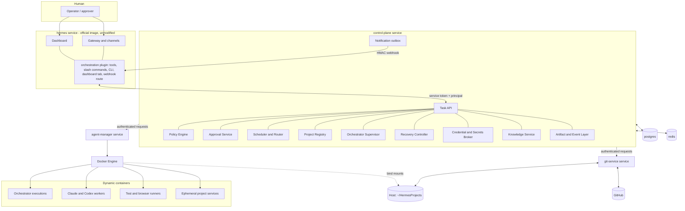
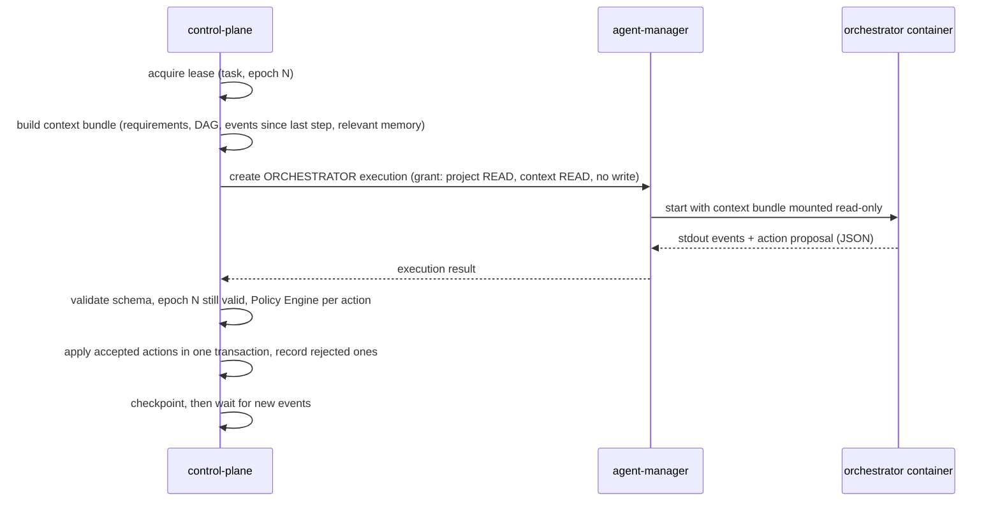
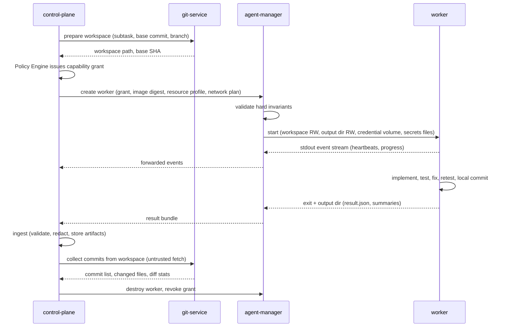
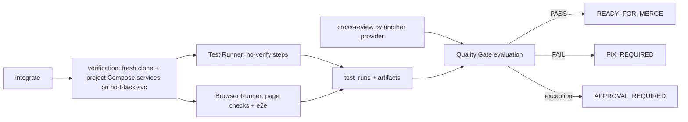

# Architecture

**Phase:** 1 (Architecture)  
**Status:** Approved by Gabriel Paredes on 2026-09-30 (PR #2)  
**Inputs:** [MASTER_SPEC.md](MASTER_SPEC.md) (source of truth), [DISCOVERY.md](DISCOVERY.md) (approved 2026-09-30)  
**Companion documents:** [SECURITY_MODEL.md](SECURITY_MODEL.md), [DATA_MODEL.md](DATA_MODEL.md), [NETWORK_MODEL.md](NETWORK_MODEL.md), [schemas/](schemas/)

This document defines the smallest secure, portable architecture that satisfies the specification. It fixes component responsibilities, service boundaries, integration contracts, and repository layout. It does not claim any runtime behavior has been implemented or tested. Items marked **Verify in Phase N** depend on interfaces that Discovery documented but did not execute.

## 1. Design Principles

1. **Official Hermes stays unmodified.** All integration uses verified extension contracts: directory plugins with `register_tool`, `register_hook`, `register_command`, `register_cli_command`, Dashboard plugins, and webhook routes (DISCOVERY §3).
2. **One execution authority.** PostgreSQL owns platform task execution state. Nothing else schedules or completes platform tasks.
3. **Hard boundaries are structural.** Mounts, networks, service identities, and absent credentials enforce security. Prompts, skills, hooks, and command classifiers are supplementary.
4. **Models propose, the control plane disposes.** No model (Hermes, Claude orchestrator, workers) holds a capability that the Policy Engine did not grant for a specific action.
5. **Everything a worker emits is untrusted input.** Results, artifacts, and events are schema-validated, size-limited, and redacted on the trusted side.
6. **Few services, clear identities.** Logical components share a process unless separation is required for a distinct privilege.

## 2. Architecture Decisions

Each decision references the Discovery finding it resolves. Rejected alternatives are recorded so that later phases do not reopen them without new evidence.

| ID | Decision | Resolves | Rejected alternative |
| --- | --- | --- | --- |
| AD-01 | Integrate with Hermes through one namespaced plugin, `orchestration`, plus a Dashboard plugin tab. No fork. | §2, §87, D10 | Forking Hermes; wrapping every component in an MCP server. |
| AD-02 | PostgreSQL is the only execution authority for platform tasks. The orchestration Hermes deployment sets `kanban.dispatch_in_gateway` to disabled, and platform tasks are not written to native Kanban boards in v1. The Dashboard shows platform tasks through a dedicated tab backed by the Task API. | D01, D02, D03 | Dual-writing native SQLite boards and PostgreSQL; projecting tasks into the native board before its mutation paths are proven safe. |
| AD-03 | Six persistent services: `hermes`, `control-plane`, `agent-manager`, `git-service`, `postgres`, `redis`. There is no persistent `claude-orchestrator` container. | §83, D14 | A long-running Claude container with standing project access. |
| AD-04 | The Claude Orchestrator is a logical role supervised by the control plane. Each orchestration step runs Claude in an orchestrator container created by Agent Manager and returns a schema-validated **action proposal**. The control plane validates and executes it. | §5, §6, D05 | Giving Claude a control-plane API token or MCP write tools. |
| AD-05 | Workers have no network path to the control plane, PostgreSQL, Redis, or Docker. Agent Manager collects each execution's stdout event stream and output directory and forwards them to the control plane for ingestion. | §59, §62, D11 | A worker-facing ingestion API with per-worker tokens. |
| AD-06 | Each task/subtask workspace is an **isolated clone** under `<project>/.hermes/worktrees/<workspace-id>` on the host, with its own branch. Linked `git worktree` checkouts are not mounted into workers. | §36, D14 | Linked worktrees, which require exposing the shared `.git` directory (refs, config, hooks) to model-controlled code. |
| AD-07 | Git Service is a separate container. It is the only holder of GitHub credentials and the only writer of branches in a project's main repository. It treats task clones as untrusted. | §39, §40, D13 | Running credential-bearing Git inside the control plane process. |
| AD-08 | Leader leases, the task queue, and idempotency are enforced in PostgreSQL (row locks, `SKIP LOCKED`, fencing epochs). Redis carries wake-ups, heartbeats, and event fan-out, all reconstructable. | §6, §61 | Redis locks as the leadership authority. |
| AD-09 | Services are written in Python 3.12 with typed models (Pydantic), FastAPI, psycopg 3, and Alembic migrations. The Hermes plugin targets the Python range of the pinned Hermes release (`>=3.11,<3.14` at the inspected release). A shared package holds contracts and schemas. | §94 | Multiple languages; a separate plugin contract library. |
| AD-10 | Human-only actions (approve, reject, raise budget, authorize `UNLIMITED`, grant production access) are never registered as LLM-callable tools. They are available only through slash commands, the Dashboard, or the host operator CLI, and the control plane verifies the principal. | §25, D08 | Exposing approvals as Hermes tools guarded by prompts. |
| AD-11 | Credential Broker v1 stores each provider session in a dedicated Docker named volume per provider identity. The volume is mounted only into containers of that provider's role. Login runs through a host operator command in an interactive bootstrap container. Phase 4: the volume holds only the login material (Claude: a `claude setup-token` subscription token, mounted read-only; Codex: `auth.json`, mounted read-write for token refresh). Each CLI's configuration directory is created fresh per execution in memory, so nothing in the volume can carry settings, hooks, or instructions between executions. | §20, D06 | Mounting the user's personal `~/.claude` or `~/.codex`; reading the macOS Keychain from Linux containers; a writable provider home shared by all executions. |
| AD-12 | Notifications are written to a durable outbox and delivered to a Hermes webhook route (HMAC-signed, `deliver_only`). | §64, §74 | A second notification stack; polling Hermes. |
| AD-13 | Artifacts live on a filesystem volume, partitioned by project. PostgreSQL stores their metadata and SHA-256. | §47, §60 | Large blobs in PostgreSQL. |
| AD-14 | Command policy is enforced by keeping high-risk capabilities out of workers entirely. High-risk operations exist only as control-plane actions. In-worker command classification is advisory and audited. | §24, D14 | Relying on a shell command classifier inside a model-controlled container. |

Decisions AD-02, AD-03, and AD-06 deviate from examples in the specification (native board reuse, the `claude-orchestrator` service in §83, and `git worktree` in §36). Each preserves the requirement's intent and is justified in the sections below.

## 3. System Context



The human talks to Hermes. Hermes talks to the control plane only through the plugin. The control plane is the only caller of Agent Manager and Git Service. Only Agent Manager talks to Docker. Only Git Service holds GitHub credentials or writes to main repositories.

## 4. Service Boundaries

| Service | Image | Holds | Must never hold | Why it is separate |
| --- | --- | --- | --- | --- |
| `hermes` | Official `nousresearch/hermes-agent`, pinned by digest after Phase 2 validation | Hermes state, channel credentials, the plugin | Docker socket, project mounts, GitHub credentials, provider sessions of managed workers | Upstream component with its own agent runtime and shell tools. |
| `control-plane` | Built from `services/control-plane` | PostgreSQL/Redis credentials, service tokens for Agent Manager and Git Service, the webhook HMAC key, the artifact volume | Docker socket, GitHub credentials, provider session contents | Business logic; runs no model-controlled code. |
| `agent-manager` | Built from `services/agent-manager` | Docker socket (read/write, through the socket's group; the process is not root), provider credential **volume names** (not contents), read-only access to the projects root (path validation only) and, from Phase 4, the project secrets directory | Database credentials, GitHub credentials | Docker access is root-equivalent; kept in the smallest possible codebase. |
| `git-service` | Built from `services/git-service` | `gh` configuration volume, read/write bind mount of the projects root | Docker socket, database credentials | GitHub credential and main-repository write access must be unreachable from model-controlled code. |
| `postgres` | Official PostgreSQL, pinned | Durable execution state | — | Standard dependency. |
| `redis` | Official Redis, pinned | Transient coordination data | Anything not reconstructable | Standard dependency. |

Logical components that share the `control-plane` process: Task API, Project Registry and onboarding, Policy Engine, Approval Service, Scheduler and Router, Orchestrator Supervisor (leader lease, step loop), Recovery Controller, Credential Broker and Secrets Broker (metadata and policy only; secret material delivery is described in SECURITY_MODEL §7), Knowledge Service, Artifact and Event Layer, Budget accounting, Quality Gate evaluator, and the notification outbox.

**Deviation from §83 (`claude-orchestrator` service):** a persistent Claude container would hold standing read access to every registered project and a provider session while idle. AD-04 gives the same persistent authority through durable state (lease, checkpoints, context artifacts, optional provider session resume) while each Claude execution is scoped to one task's projects and bounded in time. If Phase 4 or 8 shows that step-wise execution cannot meet responsiveness or session-continuity needs, a long-lived orchestrator container launched by Agent Manager (not a Compose service) is the fallback. It would keep the same grants.

## 5. Component Responsibilities

This table refines the Discovery responsibility matrix (DISCOVERY §5) into owners.

| Component | Owner | Responsibilities | Hermes reuse |
| --- | --- | --- | --- |
| Chat entry, notifications, channels | `hermes` | User conversation, delivery | YES: reused as is |
| Administration, sessions, logs, skills, cron | `hermes` Dashboard | Unchanged | YES: reused as is |
| Orchestration plugin | `hermes/plugins/orchestration` | LLM tools (read and create only), slash commands (human actions), CLI subcommands, Dashboard tab, webhook route for notifications | YES: extension contracts |
| Task API | control-plane | Idempotent task commands, queries, status answers | PARTIAL: replaces native task execution for platform tasks |
| Project Registry and onboarding | control-plane + Git Service | Registration, read-only scan request, configuration proposal, approval, `PROJECT_READY`, drift proposals | PARTIAL: maps to native project identity where available |
| Policy Engine | control-plane | Hard policies, project policies, command/action risk, capability decisions, autonomy | PARTIAL |
| Approval Service | control-plane | Action-bound approval requests, principal verification, invalidation | PARTIAL: Hermes provides presentation only |
| Scheduler and Router | control-plane | Priority, conflict awareness, concurrency and resource budgets, preemption at checkpoints, scored routing | PARTIAL |
| Orchestrator Supervisor | control-plane | Leader lease and epochs, step loop, Claude-to-Codex failover at safe checkpoints | NO: new |
| Agent Manager | agent-manager | Container, network, and volume lifecycle; hard invariant checks; log and output collection | NO: new |
| Git Service | git-service | Workspace clones, base tracking, human change detection, integration, push, PR, CI status, approved merge, post-merge verification data | PARTIAL: reuses `git` and `gh` |
| Credential Broker | control-plane (policy) + agent-manager (volume mounts) | Provider identity references, `AUTH_REQUIRED` handling, bootstrap coordination | PARTIAL |
| Secrets Broker | control-plane | Scoped secret references, delivery through Agent Manager, redaction list | PARTIAL |
| Quality Gate | control-plane | Evaluates required evidence against project policy and hard policy | PARTIAL |
| Knowledge Service | control-plane | Operational knowledge in PostgreSQL; proposals for repository knowledge files | PARTIAL |
| Artifact and Event Layer | control-plane | Artifact store, event log, audit trail, Task Manifest generation | PARTIAL |
| Recovery Controller | control-plane | Boot reconciliation, intent replay, stale lease handling, self-healing loop | PARTIAL |
| Agent adapters | shared package + worker images | `ClaudeAdapter`, `CodexAdapter` | PARTIAL: official CLIs |

## 6. Orchestration Model

### 6.1 Orchestrator step protocol

The Claude Orchestrator is invoked in steps. Each step is a bounded execution.



The action proposal vocabulary is closed. Each action has a JSON Schema defined in Phase 2 in `schemas/`:

| Action | Effect when accepted |
| --- | --- |
| `SET_REQUIREMENTS` | Stores a new requirements version. |
| `RECORD_ASSUMPTION` | Stores the assumption, reason, evidence, impact, and reversibility. HIGH ambiguity becomes `APPROVAL_REQUIRED`. |
| `SET_PLAN` | Creates or revises the DAG (subtasks, dependencies, estimated change scope, risk, resource profile, preferred provider). |
| `REQUEST_EXECUTION` | Queues a DEVELOPER, REVIEWER, or TESTER execution for a subtask with requested capabilities. |
| `REQUEST_INTEGRATION` | Asks Git Service to integrate accepted subtask branches into the task integration branch. |
| `ACCEPT_SUBTASK` / `REJECT_SUBTASK` | Records the orchestrator's assessment. Acceptance still requires review and test evidence. |
| `REQUEST_APPROVAL` | Opens an action-bound approval request (for example, scope expansion). |
| `PROPOSE_KNOWLEDGE` | Adds a knowledge item with trust state `HYPOTHESIS` or `OBSERVED`. |
| `SUBMIT_FOR_QUALITY_GATE` | Asks the control plane to evaluate the Quality Gate. |
| `REPORT_BLOCKED` | Moves the task to `BLOCKED` with a structured reason. |
| `WAIT` | Takes no action until the next event. |

Claude cannot grant capabilities, change budgets, approve, merge, or mark a task `READY_FOR_MERGE` or `DONE`. Those transitions belong to the control plane (see DATA_MODEL §4).

**Provider session continuity** (optional): the control plane may store the provider's opaque session identifier and ask the adapter to resume it. Correctness never depends on it; the context bundle is always complete. This follows §47 ("Do not depend on full conversation replay").

### 6.2 Leadership and failover

- A task has at most one lease row: `(task_id, holder, provider, epoch, expires_at)`. Acquiring or renewing it is a single-row PostgreSQL transaction.
- Every accepted action and every Agent Manager or Git Service request carries the epoch. Requests with a stale epoch are rejected.
- The lease holder is the control-plane supervisor acting for a provider (`claude` preferred, `codex` fallback). Failover to Codex happens only at a checkpoint when the Claude provider is `UNAVAILABLE` (auth, quota, outage, or repeated failure beyond the configured limit). Failback happens at the next checkpoint after Claude recovers, if policy allows.
- The Codex orchestrator uses the same step protocol and action schema through `CodexAdapter`.

### 6.3 Worker execution lifecycle



A worker lives for one logical cycle (§10): implement, test, fix, retest, and commit. Review and fix cycles use new executions. The original developer's workspace is reused, so the fix happens where the code lives.

### 6.4 Review, integration, and completion

1. A subtask developed by provider X is reviewed by provider Y ≠ X in a REVIEWER execution with read-only workspace, diff, and artifact access and test execution (§9, §12).
2. Review failure returns structured findings to the original developer through a new DEVELOPER execution on the same workspace. The configured review-cycle limit (default 2) then escalates to the alternate developer or `BLOCKED`.
3. Accepted subtasks are integrated by Git Service into the task integration branch `hermes/task-<id>`. Divergence from the project default branch is reconciled per §37 and §38.
4. A TESTER execution (Test Runner, and Browser Runner when enabled) runs the full configured suite on the integration branch.
5. The control plane evaluates the Quality Gate. When it passes, Git Service pushes the integration branch and opens or updates a PR (GitHub projects), and the task enters `READY_FOR_MERGE`.
6. A human approves the exact merge action (SECURITY_MODEL §6). Git Service revalidates the head SHA, base SHA, checks, and approval, then merges. For GitHub it uses `gh pr merge --match-head-commit`, never `--admin` or auto-merge. Local-only repositories get a local merge with the same approval.
7. Post-merge verification (configured checks on the merged default branch) passes, and the task reaches `DONE` and emits `TASK_COMPLETED`.

## 7. Integration Contracts

These are **our** interfaces. Anything that touches Hermes, Claude Code, Codex CLI, or `gh` uses only interfaces verified in Discovery and is re-verified against pinned versions in the named phase.

### 7.1 Hermes plugin (`hermes/plugins/orchestration`)

| Surface | Hermes mechanism (verified) | Exposed operations | Verify in |
| --- | --- | --- | --- |
| LLM tools | `register_tool` | `orch_task_create`, `orch_task_status`, `orch_task_inspect`, `orch_project_list`, `orch_approvals_list` (read-only listing) | Phase 9 |
| Slash commands (human) | `register_command` | `/orch approve <request-id>`, `/orch reject <request-id>`, `/orch pause|resume|cancel|retry <task>`, `/orch budget <task> <action>` | Phase 9: the handler must receive the sender identity from the gateway; otherwise human-only actions stay on the Dashboard and host CLI |
| CLI | `register_cli_command` | `hermes orchestration project|task|approval|auth ...` | Phase 9: name collision check |
| Dashboard | Dashboard plugin manifest, `router` under `/api/plugins/orchestration/` | Projects, tasks, DAG, workers, approvals, budgets, gates, reviews, tests, manifest, audit timeline | Phases 9–10: authentication tested with unauthorized requests (D08) |
| Notifications in | Webhook route with HMAC, `deliver_only` | Durable outbox delivery | Phase 9 |
| Observation | `register_hook` | Optional logging only; never used for authorization | Phase 9 |

The plugin is a thin client. It holds a service token for the Task API and forwards the principal (platform, user ID, or Dashboard session) with each request. It stores no task state.

`pause`, `resume`, `cancel`, and `retry` are not listed as LLM tools because a prompt-injected Hermes agent should not be able to cancel work. Task creation is exposed because it is bounded by policy, budget, and the onboarding state of the project.

### 7.2 Task API (control-plane, `/v1`)

REST over the internal network, with JSON bodies validated against `schemas/task.schema.json` and future action schemas. All mutating calls require `Idempotency-Key`.

| Resource | Operations |
| --- | --- |
| `projects` | register, list, get, request onboarding scan, approve configuration, unregister (never deletes files) |
| `tasks` | create, list, get, status summary, pause, resume, cancel, retry, revise requirements, inspect manifest, replay (new execution) |
| `tasks/{id}/dag` | get |
| `approvals` | list pending, get, decide (human principal required) |
| `workers` | list, get (read-only view of Agent Manager state) |
| `events` | list/stream per task (Server-Sent Events for the Dashboard) |
| `health` | liveness, readiness |

Exact routes and payloads are specified in Phase 2 alongside the implementation. This list fixes the scope, not the wire format.

### 7.3 Agent Manager API (private)

Callable only by the control plane (service token; mTLS optional later). Every request carries `task_id`, `execution_id`, `lease_epoch`, and the full signed grant.

| Operation | Notes |
| --- | --- |
| `create_execution(spec)` | `spec` = role, provider, image digest, toolchain profiles, resource profile, grant, mounts plan, network plan, env allowlist, timeouts. Idempotent on `execution_id`. |
| `stop_execution(id, mode)` | `mode` = `graceful` (checkpoint signal, then SIGTERM, then SIGKILL after timeout) or `immediate`. |
| `create_environment(spec)` / `destroy_environment(id)` | Task networks, ephemeral services, Compose projects with generated overrides. |
| `list_managed()` | Everything carrying the platform's labels, for reconciliation. |
| `stream_events(id)` / `collect_output(id)` | Stdout events and output directory contents. |

Agent Manager re-checks hard invariants independently of the Policy Engine (SECURITY_MODEL §8). Its state is the set of labeled Docker objects, so it can be restarted without losing information.

Implemented routes (Phase 3): `POST /v1/executions`, `GET /v1/executions/{id}`, `POST /v1/executions/{id}/stop`, `POST /v1/executions/{id}/collect`, `DELETE /v1/executions/{id}`, `DELETE /v1/tasks/{task}/environment`, `GET /v1/managed`, `GET /v1/capacity`. Phase 4 adds `GET /v1/credentials` (credential volume names only) and `GET /v1/images`, and these request fields: `inputs` (small text files such as the prompt, written into `/run/ho-input`), `session` (mount the task's session volume), and `secret_env` (granted secrets delivered as environment variables instead of files). Requests name images symbolically (`agent-base`); Agent Manager resolves them to the local image IDs pinned in `config/images.lock.yaml` (written by `make images`). Callers cannot pass Docker options: every mount, network, and security setting is built by Agent Manager from the grant. A background reaper stops workers whose grant expired even if the control plane is down. Test environments with ephemeral services (`create_environment`) arrive in Phase 6.

### 7.4 Git Service API (private)

| Operation | Notes |
| --- | --- |
| `scan_project(project)` | Read-only inventory for onboarding and drift detection. |
| `prepare_workspace(project, workspace_id, base_ref)` | Creates an isolated clone and branch; returns base SHA. |
| `collect_commits(workspace_id)` | Hardened fetch from the untrusted clone into `refs/hermes/...` in the main repository. |
| `check_divergence(project, base_sha, changed_paths)` | Human change classification input (§37). |
| `integrate(task, branches, target)` | Controlled merge/rebase in a Git Service-owned integration workspace. |
| `push_branch`, `create_or_update_pr`, `pr_checks` | GitHub projects only; never to protected branches. |
| `merge(task, approval_token)` | Validates the approval binding before any write. |
| `post_merge_ref(project)` | Returns the merged commit for post-merge verification. |
| `cleanup_workspace(workspace_id)` | Retention-aware removal. |

Implemented routes (Phase 5), all `POST` with the project path: `/v1/workspaces/prepare`, `/v1/workspaces/collect`, `/v1/workspaces/conflict`, `/v1/workspaces/remove`, `/v1/divergence`, `/v1/integrate`, `/v1/refs`, `/v1/merge`, `/v1/github/status`, `/v1/github/push`, `/v1/github/pr`, `/v1/github/pr/view`, `/v1/github/pr/checks`, `/v1/github/delete-branch`.

- `integrate` computes merges in the object database (`git merge-tree --write-tree`, `commit-tree`) without a working tree and stores the result as `refs/hermes/tasks/<task>/integration`; the user's branches are not touched. A conflict changes nothing and reports the files.
- `workspaces/conflict` creates a fresh clone at the target with the conflicting work merged and the conflicts left in place, so a DEVELOPER agent can resolve them (agent-assisted reconciliation, §38). Git Service runs `git merge` only in a clone it has just created, before any execution touches it.
- `merge` requires a **merge authorization** signed by the control plane (HMAC-SHA256 with `ho_merge_key`, shared only by the two services) for one approval. It binds the project, target branch, target commit, head commit, method, and pull request. Git Service verifies the signature and expiry, then re-reads the target and head (for GitHub: the PR head, base branch, and the remote base commit) and refuses if anything differs. Local merges build the merge commit in the object database and either fast-forward the checked-out branch (Git refuses when that would overwrite uncommitted changes) or move the ref with compare-and-swap. Each approval's result is recorded as `refs/hermes/merges/<approval>`, which makes retries idempotent.
- Local repositories support the `merge` and `squash` methods; `rebase` is available only through GitHub pull requests (the pinned Git 2.39 has no `--merge-base` or `git replay`).
### 7.5 AgentAdapter

Implemented in Phase 4 in [packages/ho_core/src/ho_core/adapters/](packages/ho_core/src/ho_core/adapters/).

```python
class AgentAdapter(Protocol):
    provider: str

    def build_execution(self, assignment: AgentAssignment) -> ExecutionPlan: ...      # image, command, input files
    def parse_event(self, event: dict) -> AdapterEvent | None: ...                    # allowlist; drops reasoning and messages
    def collect_result(self, bundle: OutputBundle) -> ExecutionResult: ...           # normalized agent-result
    def collect_usage(self, bundle: OutputBundle) -> UsageRecord: ...
    def classify_failure(self, bundle: OutputBundle) -> FailureClass | None: ...     # TRANSIENT, AUTH, QUOTA, TASK, UNKNOWN
    def health_check(self, *, pinned_images, credential_present, credential_status) -> ProviderHealth: ...
```

The specification's conceptual operations map as follows. `execute_task` is `build_execution` followed by `create_execution`. `resume_task` is `build_execution` with the provider session ID of an earlier execution. `cancel_task` is `stop_execution`. The adapter runs on the trusted side. The in-container runner (`/opt/ho/bin/ho-agent-run` in the provider images) only prepares the CLI's home, runs the CLI with the adapter's arguments, and writes raw output to `/output/ho/`; its output is never trusted.

| | ClaudeAdapter | CodexAdapter |
| --- | --- | --- |
| Command | `claude -p --output-format stream-json --verbose` | `codex exec --json` (`codex exec resume <id>` to resume) |
| Structured result | `--json-schema` (schemas/agent-result.schema.json) | `--output-schema` and `-o` |
| Repository configuration (OI-02) | `--setting-sources user` with an empty per-execution config dir, `--settings {"disableAllHooks": true}`, `--strict-mcp-config` | Workspace marked `untrusted` (project `.codex/` config, hooks, and rules skipped), `--ignore-user-config`, `--ignore-rules` |
| Permissions | Role-scoped `--tools`/`--allowedTools`, `--permission-mode dontAsk`, `--permission-prompts none` | `sandbox_mode="danger-full-access"`, `approval_policy="never"`: the container is the sandbox |
| Authentication | `CLAUDE_CODE_OAUTH_TOKEN` from the credential volume (subscription token from `claude setup-token`) | `auth.json` (ChatGPT login, `forced_login_method="chatgpt"`) copied into a per-execution `CODEX_HOME`; refreshed tokens are written back only if the stored copy did not change meanwhile |
| Resume | `--resume <session_id>`; transcripts in the task's session volume | `exec resume <thread_id>`; sessions in the task's session volume |

Every agent assignment must end with the structured result defined by [schemas/agent-result.schema.json](schemas/agent-result.schema.json): `status` (completed, blocked, failed), `summary`, `changed_files`, `tests`, `commits`, `follow_ups`, and `blocked_reason`. An execution succeeds only when the CLI exits 0 and returns a valid result.

## 8. Workspaces and Git

Project source stays on the host under the configured projects root (default `~/HermesProjects`).

```text
~/HermesProjects/my-app/                 # user's normal checkout (read-only to all models)
├── .git/                                # written only by git-service
└── .hermes/
    ├── project.yaml                     # version-controlled configuration
    ├── PROJECT.md, architecture.md, conventions.md, decisions/
    ├── worktrees/                       # ignored by Git; one isolated clone per workspace
    │   ├── task-284-01/                 # branch hermes/task-284/01
    │   └── task-284-integration/        # owned by git-service, never mounted RW into a worker
    └── generated/                       # temporary Compose overrides (§52)
```

**As implemented (Phase 5).** Workspaces are named `<task>-<suffix>` (for example `t-5-w1`) with branch `<branch_prefix><task>/<suffix>` (`hermes/t-5/w1`). The first workspace pins the task's base commit as `refs/hermes/tasks/<task>/base`, so every later workspace starts from it. A clone is created with `git init` and a fetch of only the base ref: it has no remote, none of the user's other branches, and none of the other tasks' refs. Git Service adds `.hermes/worktrees/` and `.hermes/generated/` to the repository's `.git/info/exclude` when they are not ignored, so the user's `git status` stays clean. An execution may mount only an active workspace registered to its own task. Collection refuses clones whose `.git` is a file or link, that use alternates or `commondir`, or that link `objects`, `refs`, or `config`; it fetches with object checking and without replace refs.

**Why isolated clones (AD-06):** a linked worktree's `.git` file points into the main repository's `.git` directory. Mounting that directory into a worker would let model-controlled code rewrite the user's refs, add hooks, or set `core.hooksPath`/`core.fsmonitor` values that execute on the host the next time the user runs Git. An isolated clone keeps §36's goals (dedicated host directory, dedicated branch, user checkout untouched) without that exposure. Git Service reads worker commits with a hardened fetch that disables hooks and fsmonitor and runs no porcelain commands inside the untrusted clone (SECURITY_MODEL §9). Object copying costs disk; Phase 5 may use `--reference` against a **read-only** mount of the main object store as an optimization.

`.hermes/worktrees/` and `.hermes/generated/` must be ignored by the project's Git. Onboarding proposes the `.gitignore` entry as part of the approved configuration change.

## 9. Configuration

### 9.1 Layers

```text
config/defaults.yaml            platform defaults (repository)
config/<machine>.yaml           machine profile: mac-m2-pro.yaml, linux.yaml (repository)
.hermes/project.yaml            project policy (project repository, schema: schemas/project.schema.json)
.hermes.local.yaml / .env       machine-local project overrides (untracked)
task override                   per-task request fields
Policy Engine                   hard policies clamp the merged result
```

Merge rule: later layers override earlier ones **only within the bounds set by hard policy**. For security-relevant fields (network, secrets, environments, autonomy, budgets, protected branches, Quality Gate requirements) the more restrictive value wins, regardless of layer order. Any restriction a lower layer sets cannot be relaxed by a higher one without an approval. The merged, clamped configuration is hashed; the hash is recorded in approvals and the Task Manifest.

### 9.2 Machine profile contents

A machine profile sets values that must not be hardcoded: the projects root, maximum concurrent agent workers (Mac M2 Pro: 3, starting mix of 1 Claude and 2 Codex), CPU/RAM per resource profile (Mac defaults LIGHT 1 CPU/2 GB, NORMAL 2 CPU/4 GB, HEAVY 4 CPU/8 GB), limits for test and browser runners, storage limits, cache locations and sizes, image digests per architecture, and the credential backend. Linux values are left for the operator to fill in from the hardware; the Linux profile ships with conservative defaults, not the Mac values.

## 10. Images and Toolchains

| Image | Base | Contents |
| --- | --- | --- |
| `agent-base` | Debian slim, pinned digest | Non-root user, Git, CA certificates, the in-container runner, no compilers |
| `claude-worker` | `agent-base` | Claude Code CLI at a pinned version |
| `codex-worker` | `agent-base` | Codex CLI at a pinned version |
| `test-runner` | `agent-base` | Test orchestration runner, no provider CLI |
| `browser-runner` | Official Playwright image, pinned | Chromium, the runner, no provider CLI |
| Toolchain layers | Per profile: `generic`, `node`, `python`, `flutter`, `php`, `java` | Built as `<role>-<profile>` combinations, for example `codex-worker-node` |

Images are built for `linux/arm64` and `linux/amd64`, tagged by content version, and referenced by digest in the machine profile. Promotion follows §19: detect, notify, approval, build candidate, smoke test, promote, or roll back. Only digests listed in the active machine profile can be launched (Agent Manager invariant).

**As implemented (Phase 6).** The Test Runner is the `runner-<toolchains>` image with `/opt/ho/bin/ho-verify`, which runs the steps the control plane planned (install, build, lint, typecheck, test, security) and writes `test_results.json` plus one log per step; a failing test step is retried once to tell flaky from definitive failures. The Browser Runner is `browser-runner`: the official Playwright image (`mcr.microsoft.com/playwright/python:v1.63.0-noble`, pinned by digest) with a non-root user, the matching Python Playwright package, `ho-verify`, and `ho-browser-check`, which records a screenshot, console messages, failed requests, and a Playwright trace per page. Both run with the container baseline and an empty in-memory home.

**As implemented (Phase 4).** [scripts/build-images.sh](scripts/build-images.sh) builds a chain for each toolchain set in `HO_TOOLCHAINS` (default `generic node python`): `agent-base` ([workers/agent-base](workers/agent-base/)), then one layer per profile ([workers/toolchains](workers/toolchains/)), then one layer per provider ([workers/providers](workers/providers/)). The lock records `runner-<set>`, `claude-<set>`, and `codex-<set>`, where `<set>` is the sorted profiles joined by `-` (for example `codex-node-python`); the control plane picks the set from the project's `toolchain.profiles`. The provider CLIs come from their official npm packages at the versions in [workers/versions.env](workers/versions.env) (Claude Code 2.1.280, Codex 0.159.2); Claude Code ships a native binary, Codex runs through its npm launcher with a private Node.js runtime. Automatic updates are disabled in the images. Flutter's SDK cache is kept read-only and exposed through a per-container `/tmp` copy of its small stamp files, because the root filesystem is read-only. Images are pinned by local image ID in the untracked `config/images.lock.yaml`, which the operator regenerates with `make images`; the §19 approval-and-promotion workflow is Phase 11.

### 10.1 Verification and Quality Gate (Phase 6)



- The change's risk (§57) comes from its files: sensitive areas (authentication, authorization, payments, migrations, Docker, infrastructure, CI/CD, secrets, permissions, dependencies, network configuration), the project's `sensitive_paths` (HIGH) and `critical_paths` (CRITICAL), and its size. Risk adds requirements: MEDIUM lint and typecheck, HIGH security checks, CRITICAL an explicit approval. The project's `quality_gate` adds its own; cross-review, requirements, no blocking findings, no conflicts, and no policy violations are always required.
- Test gaps (§56): no test command, code changed without any test changing, or a required check without a command. Gaps are recorded with the alternative evidence that ran; on HIGH or CRITICAL changes they need an explicit approval.
- The Quality Gate evaluation stores each requirement's status and evidence, the gaps, and the residual risk. It is the only path from `QUALITY_GATE` to `READY_FOR_MERGE`; a merge approval binds the evaluation it was requested on. A pending verification or CI run leaves the task in `QUALITY_GATE` for re-evaluation.

## 11. Persistent Volumes

| Volume | Mounted in | Backed up | Notes |
| --- | --- | --- | --- |
| `hermes-data` | hermes | Allowlisted non-secret parts only | Container-native volume, not a host bind mount, because of the SQLite WAL hazard on VM-shared filesystems (D09) |
| `pg-data` | postgres | Yes (logical dump) | |
| `redis-data` | redis | No | Optional; state is reconstructable |
| `artifacts` | control-plane (RW), agent-manager (RW, output collection) | Configurable | Partitioned `/<project_id>/<task_id>/` |
| `cred-<provider>-<identity>` | agent-manager mounts into matching provider containers only | **Never** | Provider login material; created by `make auth-<provider>` |
| `ho-sess-<task>-<provider>` | That task's executions of that provider | **Never** | Provider session transcripts for resume; removed when the task ends |
| Secrets directory (bind, read-only) | agent-manager | **Never** | Project secret values (SECURITY_MODEL §7.3) |
| `gh-config` | git-service | **Never** | GitHub CLI credentials |
| `cache-<machine>-<ecosystem>-<project>` | Workers of that project | No | Download caches only (§71) |
| Projects root (bind) | git-service (RW); agent-manager passes specific sub-paths to workers | Via Git | |

## 12. Repository Layout

```text
hermes-orchestrator/
├── compose.yaml
├── compose.override.example.yaml
├── .env.example
├── Makefile
├── README.md
├── MASTER_SPEC.md, PHASES.md, DISCOVERY.md
├── ARCHITECTURE.md, SECURITY_MODEL.md, DATA_MODEL.md, NETWORK_MODEL.md
├── compose.test.yaml              # throwaway PostgreSQL and Redis for integration tests
├── requirements.lock             # pinned Python dependency versions for images
├── config/
│   ├── defaults.yaml
│   ├── mac-m2-pro.yaml
│   ├── linux.yaml
│   └── local.yaml                # optional, untracked machine-specific overrides
├── packages/
│   └── ho_core/              # shared typed contracts, schema loading, policy types, adapters
├── services/
│   ├── control-plane/
│   ├── agent-manager/
│   └── git-service/
├── workers/
│   ├── agent-base/
│   ├── claude/
│   ├── codex/
│   ├── test-runner/
│   └── browser-runner/
├── toolchains/
│   └── generic/ node/ python/ flutter/ php/ java/
├── hermes/
│   ├── plugins/orchestration/   # plugin.yaml, __init__.py, dashboard/
│   ├── skills/                  # operator guidance only; not an authorization boundary
│   └── config/                  # Hermes configuration fragments (for example, dispatch disabled)
├── schemas/
│   ├── project.schema.json
│   ├── task.schema.json
│   ├── manifest.schema.json
│   ├── capability.schema.json
│   └── examples/
├── migrations/
├── scripts/                      # auth bootstrap, backup, restore, update, rollback
├── tests/
│   ├── unit/ integration/ security/ scenarios/
└── docs/
    ├── discovery/
    ├── recovery.md, policies.md, operations.md
```

Deviations from §84, with reasons:

| Change | Reason |
| --- | --- |
| No `services/claude-orchestrator/` | AD-03/AD-04: the orchestrator runs in `workers/claude` images with the ORCHESTRATOR role. |
| Added `services/git-service/` | AD-07: separate privilege domain for GitHub credentials. |
| Added `packages/ho_core/` | Shared contracts between services and the Hermes plugin (AD-09). |
| No `hermes/hooks/` | Hooks are registered through the plugin (`register_hook`). A separate directory is added only if a verified standalone mechanism is needed. |
| Architecture documents at the root, not `docs/architecture.md` and `docs/security.md` | Phase 1 requires `ARCHITECTURE.md` and `SECURITY_MODEL.md` by name; `docs/` keeps operations, recovery, and policy guides. |

## 13. Observability

Every state transition and significant action writes a structured event (DATA_MODEL §7) in the same transaction as the change. The control plane logs JSON lines with `task_id`, `execution_id`, `project_id`, and `lease_epoch`. Resource usage comes from Docker statistics collected by Agent Manager. Provider usage comes from adapter usage records. v1 has no Prometheus or Grafana. The event schema and a `/metrics` seam leave room for OpenTelemetry later (§73).

Adaptive reporting (§72): the outbox classifies events. Attention events (`APPROVAL_REQUIRED`, `AUTH_REQUIRED`, `BLOCKED`, `PAUSED_BUDGET`, definitive `TEST_FAILED`, `READY_FOR_MERGE`, recovery failure, `TASK_COMPLETED`) are delivered immediately. Routine events are aggregated into periodic digests. Status questions are answered from PostgreSQL through `orch_task_status`.

## 14. Failure and Recovery Outline

Implemented in Phase 8; procedures in [docs/recovery.md](docs/recovery.md). The architecture guarantees the inputs:

- **Durable intents:** before calling Agent Manager or Git Service, the control plane writes an `operation_intent` row; after the call it records the outcome. On restart, pending intents are reconciled against Docker labels and Git refs.
- **Boot order:** postgres healthy, redis healthy, control plane, then Recovery Controller reconciliation (leases, intents, managed containers, workspaces), then the scheduler resumes. Dead containers are never resurrected; new executions start from checkpoints.
- **Hermes outage:** already-authorized executions continue. New approval requests wait in `APPROVAL_REQUIRED`. The outbox retries with backoff.
- **Redis loss:** queue wake-ups and heartbeats are rebuilt from PostgreSQL; leases are unaffected (AD-08).

**Phase 11:** several stacks may share one Docker host (for example the operator's stack and a smoke-test stack): Agent Manager labels every resource with `ho.stack` (the Compose project name) and lists, reaps, and cleans up only its own; task-scoped names are prefixed with the stack name outside the main stack. Production runs one stack per host.

## 15. Open Items for Later Phases

| ID | Item | Phase |
| --- | --- | --- |
| OI-01 | Confirm slash command handlers receive a verifiable sender identity (AD-10). **Resolved in Phase 9:** at the pinned release the gateway authorizes the sender for the message's source, then runs plugin command handlers inside `_session_env_scope(build_session_context(source))`, so `gateway.session_context.get_session_env("HERMES_SESSION_PLATFORM"/"HERMES_SESSION_USER_ID")` is the authenticated sender (`gateway/run_inbound.py`); verified in the real image by `tests/hermes/probe.py`. | 9 |
| OI-02 | Confirm official Claude Code and Codex settings that restrict repository-defined hooks, MCP servers, and project configuration in non-interactive mode (D05). **Resolved in Phase 4:** Claude Code `--setting-sources user` (documented to read neither project settings nor `.mcp.json`), `--settings {"disableAllHooks": true}`, `--strict-mcp-config`; Codex `projects."/workspace".trust_level="untrusted"` (documented to skip project `.codex/` config, hooks, and rules), `--ignore-user-config`, `--ignore-rules`. See §7.5. | 4 |
| OI-03 | Confirm credential refresh behavior when several containers share one provider identity volume; otherwise use one identity per concurrent slot or serialize (D06). **Phase 4:** Claude's `setup-token` token does not refresh, so sharing it is safe (read-only). Codex refreshes during use; each execution works on its own copy and writes a refreshed login back under a lock only if the stored copy is unchanged. Whether a refresh invalidates the copy another running execution holds could not be measured without a real login and is recorded as a limitation; `HO_PROVIDER_IDENTITY` allows one identity per machine or stack. | 4 |
| OI-04 | Confirm Dashboard plugin route authentication with unauthorized requests (D08). **Resolved in Phase 9:** `/api/plugins/orchestration/*` returns 401 without a Dashboard session and with a wrong password, and 200 after the bundled basic-auth login (a non-loopback bind requires an auth provider at this release). | 9 |
| OI-05 | Choose the egress proxy image and allowlist mechanism for restricted networks (NETWORK_MODEL §5). **Resolved in Phase 3:** purpose-built CONNECT-only proxy (`services/egress-proxy`), one per agent execution. | 3 |
| OI-06 | Measure the disk and time cost of isolated clones on large repositories; evaluate the read-only `--reference` optimization. **Phase 5:** a repository with 72 MB of history and 60 MB of files clones in 3.4 s and uses 121 MB per workspace; collecting without new commits takes 0.12 s. `--reference` is not viable: the clone would depend on the main repository's object store, which is not mounted in workers. Shallow workspaces are the option to evaluate if disk use becomes a problem. | 5 |
| OI-07 | Validate the pinned Hermes image boots with the plugin on both architectures, and that SQLite state uses a container-native volume (D07, D09). **Phase 2 result:** the pinned index digest boots on `linux/arm64` and on `linux/amd64` (emulated) with a named volume at `HERMES_HOME=/opt/data`, reports `v0.21.5 (2026.9.24) · upstream f97608f1`, and its OCI revision label matches the inspected commit. Booting *with the plugin* moves to Phase 9, when the plugin exists. See [docs/validation/phase-2.md](docs/validation/phase-2.md). **Phase 9:** the pinned image runs in Compose with the plugin (`hermes plugins list`: enabled) and a container-native `hermes-data` volume on macOS (Apple Silicon). | 2, 9 |
| OI-08 | Decide whether a read-only projection into the native Kanban board is worth adding after v1 (AD-02). | 10 |
