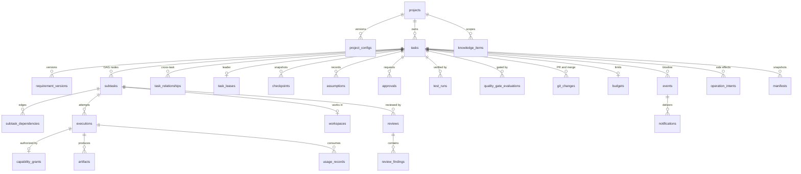
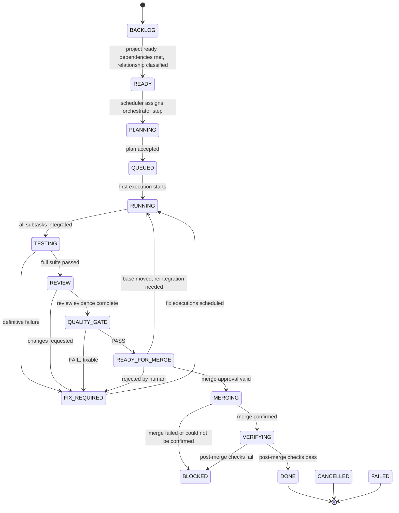

# Data Model

**Phase:** 1 (Architecture)  
**Status:** Approved by Gabriel Paredes on 2026-09-30 (PR #2)  
**Inputs:** [MASTER_SPEC.md](MASTER_SPEC.md) sections 14–17, 25, 27–30, 42–49, 60–61, 70, 79–80  
**Related:** [ARCHITECTURE.md](ARCHITECTURE.md), [SECURITY_MODEL.md](SECURITY_MODEL.md), [schemas/](schemas/)

This document defines what is stored, where, and how state changes. Column lists fix meaning and constraints; exact DDL is written as migrations in Phase 2.

## 1. Storage Map

| Store | Authority for | Must not contain | Backed up |
| --- | --- | --- | --- |
| PostgreSQL (`ho` database) | Projects, tasks, DAGs, executions, grants, leases, checkpoints, approvals, reviews, tests, Quality Gates, Git/PR records, budgets, usage, knowledge metadata, events, outbox, manifests | Secrets, provider or GitHub credentials, raw provider transcripts, model reasoning | Daily logical dump |
| Redis | Nothing authoritative. Wake-ups, heartbeats, event fan-out, cached counters | Anything not reconstructable from PostgreSQL, Docker labels, or Git | Never |
| Artifact volume | Artifact content (context bundles, results, logs, test reports, screenshots, traces, manifests) | Unredacted output | Configurable |
| Host project repositories | Source code, branches, commits, `.hermes/` configuration and stable knowledge | Platform state | Via Git/GitHub |
| Docker labels | Which dynamic objects exist for which execution | Anything else | Never |
| Hermes storage (SQLite, files) | Native Hermes data only | Platform task execution state | Allowlisted non-secret parts |
| Credential volumes, `gh-config`, secrets directory | Credentials | Anything else | Never |

**Rule:** a fact has exactly one authority. Other stores hold references or caches that the Recovery Controller can rebuild.

## 2. Entity Overview



## 3. Tables

Migration `0001` (Phase 2) creates `projects`, `project_configs`, `onboarding_scans`, `artifacts`, `tasks`, `task_relationships`, `budgets`, `approvals`, `policy_decisions`, `events`, `notifications`, `idempotency_keys`, and `operation_intents`. Migration `0002` (Phase 3) adds `executions` and `capability_grants` and links `policy_decisions` to executions. In `0002`, `executions` also stores the exact request sent to Agent Manager (`spec`, which contains no secrets), `dispatch_attempts`, and failure classes `CAPACITY`, `POLICY`, `TIMEOUT`, `LOST`, and `CANCELLED` in addition to the adapter classes; subtask references arrive with the DAG in Phase 7. Migration `0003` (Phase 4) adds `credential_refs` (provider, identity, status `UNKNOWN`/`READY`/`AUTH_REQUIRED`, last verification and error; never tokens), `usage_records`, and on `executions` the columns `agent_run`, `provider_session_id` (the CLI's opaque session ID, used only to resume), `resume_of` (the execution this one continues, unique), and `result` (the normalized, redacted agent result). It also adds `tasks.waiting_on_credential` (the provider identity an `AUTH_REQUIRED` task waits for) and `tasks.environment_released_at`. Migration `0005` (Phase 6) adds `verifications` (purpose `INTEGRATION` or `POST_MERGE`, the verified commit, the plan with risk, requirements, steps, and gaps, the test environment, and the runner executions), `test_runs` (one row per step and runner, with scope, kind, status, attempts, and report and log artifacts), `reviews` (a check constraint keeps the reviewer's provider out of the developers' providers) and `review_findings`, `quality_gate_evaluations` (requirements with status and evidence, test gaps with alternative evidence, risk, residual risk, outcome), and `git_changes.quality_gate_id`. Migration `0004` (Phase 5) adds `tasks.base_commit` and `tasks.target_branch`, `workspaces` (with `kind` `DEVELOPMENT`, `CONFLICT`, or `VERIFICATION`, and `collected_at`), and `git_changes` (one row per task: base, integration ref and commit, the target commit it was built on, conflicts, retest execution and status, divergence result and level, `reconcile_required`, remote branch and pushed commit, PR number, URL, and CI snapshot, the merge approval, merge commit, and post-merge verification execution and status). Migration `0006` (Phase 7) adds `task_leases`, `requirement_versions`, `assumptions`, `subtasks` and `subtask_dependencies`, `orchestrator_actions`, `knowledge_items`, `manifests`, and `pending_launches`; `subtask_id` on `executions` and `reviews`; `budgets.reserved` and `executions.budget_reservation`; and the orchestration columns on `tasks`. Later phases add the remaining tables with their own migrations.

Conventions: primary keys are UUIDv7 (`id`) unless stated. Human-facing identifiers (`T-284`, `T-284-02`) are unique per installation and generated from sequences. All timestamps are `timestamptz` in UTC. `jsonb` payloads have a JSON Schema in `schemas/` or in the Phase 2 contract package. Every mutable row has `created_at`, `updated_at`, and `version` (optimistic concurrency).

### 3.1 Projects and configuration

**`projects`** (§14)

| Column | Notes |
| --- | --- |
| `id`, `slug` (unique), `name` | |
| `host_path` | Absolute, resolved, unique; must be inside the configured projects root |
| `git_remote`, `default_branch` | `git_remote` null for local-only repositories |
| `status` | See §4.5 |
| `config_path` | Normally `.hermes/project.yaml` |
| `knowledge_path` | Normally `.hermes/` |
| `hermes_project_ref` | Optional mapping to a native Hermes project identity |
| `registered_at`, `registered_by` | Principal |

Unregistering sets `status = UNREGISTERED`. It never deletes files (§14).

**`project_configs`**: one row per effective configuration version: `project_id`, `source_commit`, `project_yaml_sha256`, `effective_config` (jsonb, merged and clamped, no secret values), `effective_hash`, `policy_version`, `approved_by_approval_id`, `status` (`PROPOSED`, `ACTIVE`, `SUPERSEDED`, `REJECTED`). Exactly one `ACTIVE` row per project (partial unique index).

**`onboarding_scans`** and **`drift_reports`**: scan results referencing artifacts (detected languages, commands, Compose, CI, risks) and proposed changes with sensitivity classification (§17).

### 3.2 Tasks, requirements, and DAG

**`tasks`**

| Column | Notes |
| --- | --- |
| `id`, `key` (`T-284`), `project_id` | |
| `title`, `original_request_artifact_id` | The request text is stored as an artifact |
| `requested_by` | Principal |
| `priority` | `CRITICAL`, `HIGH`, `NORMAL`, `LOW` |
| `state`, `resume_state` | §4.1; `resume_state` is set while in a waiting state |
| `state_reason` | Short structured reason code plus summary |
| `autonomy` | Effective profile |
| `expansion_profile`, `budget_profile` | `SMALL`, `NORMAL`, `LARGE`, `UNLIMITED` |
| `current_requirements_version`, `current_plan_version` | |
| `base_commit`, `integration_branch` | Set by Git Service |
| `config_id` | `project_configs` row used |
| `risk` | LOW to CRITICAL, from the latest assessment |
| `idempotency_key` | Unique per requester |
| `queued_at`, `started_at`, `completed_at` | |

**`requirement_versions`**: `task_id`, `version`, `artifact_id`, `change_reason`, `source` (`USER`, `ORCHESTRATOR`), `impact` (jsonb: per-subtask `KEEP`, `REPLAN`, `CANCEL`, `NEW`), `approval_id` (if required). Append-only (§43).

**`subtasks`**

| Column | Notes |
| --- | --- |
| `id`, `key` (`T-284-02`), `task_id`, `plan_version` | |
| `kind` | `IMPLEMENT`, `TEST_AUTHORING`, `INTEGRATION`, `VERIFICATION`, `RESEARCH` |
| `title`, `spec_artifact_id` | |
| `state` | §4.2 |
| `developer_provider`, `reviewer_provider` | Must differ once review is assigned (check constraint) |
| `estimated_scope` | jsonb: files, modules, APIs, DB areas, infrastructure, dependencies (§32) |
| `risk`, `resource_profile` | |
| `review_cycles`, `attempts` | Counters checked against limits |
| `workspace_id` | |

**`subtask_dependencies`**: `(subtask_id, depends_on_subtask_id)`; cycle rejection at insert time within one plan version.

**`task_relationships`** (§42, §77): `from_task_id`, `to_task_id`, `kind` (`DUPLICATE`, `RELATED`, `DEPENDENCY`, `CONFLICTING`, `INDEPENDENT`), `classified_by`, `evidence`. A `DEPENDENCY` blocks the dependent task in `BACKLOG`. `DUPLICATE` never deletes the new request; the new task is linked and waits for a user decision or merges into the original's history with a recorded event.

### 3.3 Execution

**`executions`**: one attempt by one container.

| Column | Notes |
| --- | --- |
| `id`, `task_id`, `subtask_id` (nullable for ORCHESTRATOR and task-level TESTER) | |
| `role` | `ORCHESTRATOR`, `DEVELOPER`, `REVIEWER`, `TESTER`, `BROWSER` |
| `provider`, `provider_identity` | `claude`, `codex`, or `none` for runners |
| `image_digest`, `toolchain_profiles`, `cli_version` | For manifests |
| `resource_profile` | |
| `state` | §4.3 |
| `lease_epoch` | Epoch at creation; stale epochs cannot complete it |
| `container_id` | Informational; Docker labels are authoritative for existence |
| `provider_session_ref` | Opaque resume reference, optional |
| `result_artifact_id`, `failure_class`, `exit_code` | |
| `started_at`, `heartbeat_at`, `ended_at` | `heartbeat_at` is flushed from Redis periodically |

**`capability_grants`**: `id`, `execution_id` (unique), `project_id`, `task_id`, `grant` (jsonb conforming to `schemas/capability.schema.json`), `requested` (jsonb, what the orchestrator asked for), `decision_log` (policy rule IDs applied), `issued_at`, `expires_at`, `revoked_at`, `revoked_reason`.

**`workspaces`**: `id`, `project_id`, `task_id`, `subtask_id`, `path` (relative to the project root), `branch`, `base_sha`, `head_sha`, `status` (`ACTIVE`, `RETAINED`, `REMOVED`), `retain_until`.

**`task_leases`** (§6): primary key `task_id`, `holder` (control-plane instance ID), `provider`, `epoch` (monotonic `bigint`), `acquired_at`, `renewed_at`, `expires_at`. Acquisition is `UPDATE ... SET epoch = epoch + 1 ... WHERE expires_at < now() OR holder = $me`. Every state change caused by orchestration checks `epoch` in the same transaction. Implemented in Phase 7 (migration `0006`) with acquisition and renewal separated: acquiring (new leader or failover) bumps `epoch`; renewing only extends `expires_at`. Executions requested by orchestration store `lease_epoch`; a fenced execution whose epoch is stale at dispatch is cancelled (`POLICY`), and a step's actions are rejected when the epoch moved. Related Phase 7 tables: `orchestrator_actions` (every proposed action with `ACCEPTED`/`REJECTED` and the reason, for audit and as feedback to the next step) and `pending_launches` (launches waiting for capacity, budget, a scope conflict, or a higher-priority task; retried each scheduler tick by effective priority with aging from `tasks.launch_suspended_at`). `tasks` gains `orchestrator_cursor_seq` (only trigger events after it start a step), `orchestrator_failures`, `step_requested`, `current_requirements_version`, and `current_plan_version`.

**`checkpoints`**: `id`, `task_id`, `seq`, `kind` (`STEP`, `PRE_PAUSE`, `PRE_FAILOVER`, `PRE_MERGE`, `PRE_REVISION`, `PRE_UPDATE`), `lease_epoch`, `task_state`, `snapshot` (jsonb: requirements and plan versions, subtask states, workspace heads, active execution IDs, budget counters, pending intents), `created_at`. A checkpoint is "safe" for failover or preemption when it has no in-flight atomic intents.

**`operation_intents`**: durable record of side effects on Docker or Git (ARCHITECTURE §14): `id`, `task_id`, `kind`, `target`, `request` (jsonb), `state` (`PENDING`, `SENT`, `CONFIRMED`, `FAILED`, `ABANDONED`), `lease_epoch`, `attempts`, `last_error`. Idempotent: Agent Manager and Git Service key operations on the intent ID.

### 3.4 Reviews, tests, Quality Gate, Git

**`reviews`**: `id`, `subtask_id` or `task_id` (integration review), `reviewer_execution_id`, `developer_provider`, `reviewer_provider` (check: different), `cycle`, `outcome` (`APPROVED`, `CHANGES_REQUESTED`, `BLOCKED`), `summary`.

**`review_findings`**: `review_id`, `severity` (`LOW`, `MEDIUM`, `HIGH`, `CRITICAL`), `category`, `path`, `line_range`, `description`, `status` (`OPEN`, `FIXED`, `WONT_FIX_APPROVED`, `INVALID`), `resolved_in_execution_id`.

**`test_runs`**: `id`, `task_id`, `subtask_id` (nullable), `execution_id`, `scope` (`RELEVANT`, `FULL_SUITE`, `BROWSER`, `POST_MERGE`), `commit_sha`, `status` (`PASSED`, `FAILED`, `ERROR`, `SKIPPED`), `totals` (jsonb), `report_artifact_id` (`test_results.json`), `definitive` (bool, set after retry policy).

**`quality_gate_evaluations`**: `id`, `task_id`, `commit_sha`, `config_hash`, `policy_version`, `requirements` (jsonb: each required condition with `status` and evidence reference), `test_gaps` (§56), `residual_risk`, `outcome` (`PASS`, `FAIL`), `evaluated_at`. A merge approval binds to one evaluation ID.

**`git_changes`**: `task_id`, `integration_branch`, `head_sha`, `base_sha`, `remote_branch`, `pr_number`, `pr_url`, `ci_status` (jsonb snapshot), `merge_commit_sha`, `merged_at`, `merged_by_approval_id`, `post_merge_status`.

**`human_change_observations`** (§37): `task_id`, `observed_base_sha`, `changed_paths`, `classification` (`LOW`, `MEDIUM`, `HIGH`, `CRITICAL`), `action_taken`.

### 3.5 Approvals, policy, and assumptions

**`approvals`**: fields from SECURITY_MODEL §6.2 plus `state` (§4.4), `consumed_at`, `invalidated_reason`, `channel_message_refs` (notification IDs).

**`policy_decisions`**: `id`, `task_id`, `execution_id`, `subject` (action or command), `class` (`SAFE`, `CONTROLLED`, `HIGH_RISK`), `decision` (`ALLOW`, `DENY`, `REQUIRE_APPROVAL`), `rule_ids`, `summary`. Append-only.

**`assumptions`** (§44): `task_id`, `level` (`LOW`, `MEDIUM`, `HIGH`), `assumption`, `reason`, `evidence`, `impact`, `reversibility`, `status` (`ACTIVE`, `CONFIRMED`, `CORRECTED`), `approval_id`.

### 3.6 Budgets and usage

**`budgets`**: `task_id`, `profile`, `limits` (jsonb: `runtime_minutes`, `agent_launches`, `retries`, `review_cycles`, `provider_usage_units`, `subtasks`), `consumed` (same keys), `thresholds` (default 70/85/100 percent), `state` (`OK`, `WARNING`, `OPTIMIZE`, `EXHAUSTED`), `unlimited_approval_id`. Phase 7 adds `reserved` (same keys): each launch reserves one launch, a retry when it is one, and an estimated provider-usage charge (200,000 tokens) atomically under the budget row lock; `executions.budget_reservation` records it, and finalize replaces it with the reported usage (input + output + cache-creation tokens), releases it when the execution never started, or charges it in full when the execution was lost.

**`usage_records`**: `execution_id`, `provider`, `units` (jsonb as reported by the adapter: tokens, requests, or other provider units), `cpu_seconds`, `max_memory_bytes`, `wall_seconds`. Provider usage units are whatever the CLI reports; the platform does not invent pricing. Implemented in Phase 4 with `execution_id`, `task_id`, `project_id`, `provider`, `units`, and `wall_seconds`; Docker CPU and memory statistics are added with the metrics work in Phase 11. Claude Code reports input, output, and cache tokens, turns, and a client-side cost estimate (stored as `reported_cost_usd_estimate`, not billing); Codex reports input, cached input, output, and reasoning token counts per turn (counts only; no reasoning content).

### 3.7 Knowledge

**`knowledge_items`** (§45–46): `project_id`, `category` (`DISCOVERY`, `CONVENTION`, `DECISION`, `KNOWN_ISSUE`, `ARCHITECTURE`, `LESSON_LEARNED`), `trust` (`CONFIRMED`, `OBSERVED`, `HYPOTHESIS`, `STALE`, `REJECTED`), `title`, `body` (short), `provenance` (task, execution, source URLs with versions), `anchors` (paths or symbols whose change marks the item `STALE`), `observed_at_commit`, `repo_path` (set when promoted to `.hermes/`), `superseded_by`.

Promotion to repository knowledge (`CONFIRMED` + file in `.hermes/`) goes through a normal task branch and merge approval. Retrieval selects items by project, anchors overlapping the subtask's estimated scope, category, and trust (never `REJECTED`; `STALE` only with a warning).

### 3.8 Artifacts, events, notifications, manifests

**`artifacts`**: `id`, `project_id`, `task_id`, `execution_id`, `kind` (for example `original_request`, `requirements`, `plan`, `context_bundle`, `result`, `changed_files`, `test_results`, `developer_summary`, `review_feedback`, `browser_trace`, `screenshot`, `log`, `manifest`), `path` (relative to the artifact volume), `sha256`, `size_bytes`, `media_type`, `redacted` (bool), `retain_until`.

**`events`**: append-only `bigserial` `seq`, `occurred_at`, `project_id`, `task_id`, `subtask_id`, `execution_id`, `type` (§7), `actor` (service, principal, or provider role), `summary`, `data` (jsonb, schema per type), `audit` (bool). The application role has `INSERT` and `SELECT` only.

**`notifications`** (outbox, §64, §72): `id`, `event_seq`, `priority` (`ATTENTION`, `ROUTINE`), `channel_target`, `payload`, `state` (`PENDING`, `SENT`, `FAILED`, `SUPPRESSED`), `attempts`, `next_attempt_at`, `delivered_at`. Routine notifications are aggregated into digests.

**`manifests`**: `task_id`, `kind` (`READY_FOR_MERGE`, `FINAL`, `ON_DEMAND`), `artifact_id`, `sha256`, `generated_at`. Content conforms to `schemas/manifest.schema.json`.

**`idempotency_keys`**: `(principal, key)` primary key, `request_hash`, `response` (jsonb), `created_at`, `expires_at`. Same key with a different request hash is rejected with a conflict error.

## 4. State Machines

Transitions are executed only by the control plane, in one transaction that updates the row (with `version` check), writes an event, and enqueues notifications. A transition not in these tables is rejected.

### 4.1 Task

States from §27, plus two additions:
- `AUTH_REQUIRED`: listed as a safe waiting state in §63 and as an event in §20.
- `VERIFYING`: separates post-merge verification from the merge itself, so recovery knows whether the merge already happened (§28).



Cross-cutting transitions (not drawn):

| From | To | Trigger | Resume |
| --- | --- | --- | --- |
| Any active state | `APPROVAL_REQUIRED` | Action needs approval (scope, ambiguity, high risk) | Back to `resume_state` on approval; to `FIX_REQUIRED`, `BLOCKED`, or `CANCELLED` on rejection, as the request specifies |
| Any active state | `AUTH_REQUIRED` | Provider identity needs login and no alternate provider is allowed | `resume_state` after re-login |
| Any active state | `PAUSED` | User pause (graceful, §68) | `resume_state` on resume |
| Any active state | `PAUSED_BUDGET` | Budget at 100 percent | `resume_state` on Continue or Increase (approval); `CANCELLED` on Cancel |
| Any active state | `BLOCKED` | Both providers failed, hard conflict, recovery failure | Human command: retry to `READY` or `resume_state`, or cancel |
| Any non-terminal state except `MERGING`, `VERIFYING` | `CANCELLED` | User cancel (graceful, §69) | Terminal |
| `MERGING`, `VERIFYING` | — | Cancel is rejected; the merge must be reconciled first | — |
| Any active or waiting state | `FAILED` | Unrecoverable platform error or policy terminal failure | Explicit retry creates a new linked task |
| `FAILED`, `CANCELLED` | — | Explicit retry or replay creates a **new** task (starting in `BACKLOG`) linked by a `RELATED` relationship; the original stays terminal | Replay never reopens old grants |

"Active states" are `READY` through `READY_FOR_MERGE` in the diagram; `BACKLOG` may also be paused or cancelled. Waiting states persist across restarts and never time out into approval. The implementation is `packages/ho_core/src/ho_core/statemachine.py`; transitions that can only be caused by the control plane (`READY_FOR_MERGE`, `MERGING`, `VERIFYING`, `DONE`) reject the orchestrator as trigger, and `MERGING` requires a consumed merge approval.

`READY_FOR_MERGE` is not `DONE`. `TASK_COMPLETED` is emitted only on the `VERIFYING → DONE` transition (§28).

### 4.2 Subtask

| State | Meaning | Next |
| --- | --- | --- |
| `PENDING` | Dependencies not met | `READY` |
| `READY` | Schedulable | `QUEUED` |
| `QUEUED` | Waiting for capacity or conflict window | `RUNNING` |
| `RUNNING` | Developer execution active | `REVIEW`, `FIX_REQUIRED`, `FAILED`, `BLOCKED` |
| `REVIEW` | Opposite-provider review active | `ACCEPTED`, `FIX_REQUIRED` |
| `FIX_REQUIRED` | Findings or test failures to fix | `RUNNING` (same or alternate developer), `BLOCKED` after limits |
| `ACCEPTED` | Reviewed and tested; ready to integrate | `INTEGRATED` |
| `INTEGRATED` | Merged into the task integration branch | terminal for the subtask |
| `BLOCKED`, `FAILED`, `CANCELLED` | As for tasks | retry or terminal |
| `SUPERSEDED` | Replaced by a plan revision (`REPLAN` or `CANCEL` impact) | terminal |

Phase 7 implementation: the stored states are `PENDING`, `READY`, `IN_PROGRESS` (developer execution queued or active; shown as `RUNNING` in manifests), `IN_REVIEW` (`REVIEW`), `FIX_REQUIRED`, `ACCEPTED`, `INTEGRATED`, `BLOCKED`, and `CANCELLED` (a plan revision cancels subtasks it drops instead of using `SUPERSEDED`). An alternate developer starts a fresh attempt in a new workspace; the earlier workspace is retained but no longer integrated.

### 4.3 Execution

`REQUESTED → STARTING → RUNNING → STOPPING → {SUCCEEDED | FAILED | CANCELLED}`, and `RUNNING → LOST` when heartbeats and Docker state show the container is gone without a result. `LOST` executions are never resurrected; the scheduler creates a new execution from the last checkpoint (§65).

### 4.4 Approval

`PENDING → {APPROVED | REJECTED | EXPIRED | INVALIDATED}`, `APPROVED → {CONSUMED | INVALIDATED | EXPIRED}`. Only `APPROVED` and unexpired approvals whose state hash matches at use time can be consumed (SECURITY_MODEL §6.3).

### 4.5 Project

`REGISTERED → SCANNING → PROPOSED → PROJECT_READY`, `PROPOSED → REGISTERED` (proposal rejected, rescan), `PROJECT_READY → DRIFT_DETECTED → PROJECT_READY` (after an approved or authorized trivial update), `PROJECT_READY → SUSPENDED` (operator), any state `→ UNREGISTERED`. Tasks can only leave `BACKLOG` when the project is `PROJECT_READY`. `DRIFT_DETECTED` with sensitive changes pauses new task planning for the project until approval.

## 5. Checkpoints and Recovery Data

A task checkpoint is written:

- after every accepted orchestrator step;
- before pause, failover, requirement revision, merge, and platform updates;
- after each execution result is ingested.

Recovery (ARCHITECTURE §14) uses: latest checkpoint + `operation_intents` not `CONFIRMED` + Docker labels (`list_managed`) + Git refs and workspace heads. For each pending intent, the Recovery Controller asks the callee whether the operation happened (by intent ID) and marks it `CONFIRMED` or re-sends it. Executions whose containers are gone become `LOST`.

## 6. Redis Keys

All keys have TTLs or are rebuilt on start. Prefix `ho:`.

| Key | Type | Purpose | Rebuilt from |
| --- | --- | --- | --- |
| `ho:wake:scheduler` | Stream | Wake the scheduler after state changes | PostgreSQL scan on start |
| `ho:hb:exec:<execution_id>` | String, TTL | Execution heartbeat | Docker state; missing heartbeat triggers a check, not an immediate `LOST` |
| `ho:events:task:<task_id>` | Pub/Sub | Live Dashboard updates | `events` table |
| `ho:capacity:<machine>` | Hash | Cached counts of running executions by provider and role | `executions` where state is active |
| `ho:ratelimit:<provider>` | String, TTL | Backoff after quota errors | Provider health records |

## 7. Event Types

Events use the §73 names where they exist. Initial set:

`PROJECT_REGISTERED`, `PROJECT_SCAN_COMPLETED`, `PROJECT_READY`, `CONFIG_DRIFT_DETECTED`, `TASK_CREATED`, `TASK_RELATIONSHIP_CLASSIFIED`, `TASK_STATE_CHANGED`, `TASK_STARTED`, `REQUIREMENTS_VERSIONED`, `PLAN_VERSIONED`, `ASSUMPTION_RECORDED`, `LEASE_ACQUIRED`, `LEASE_LOST`, `FAILOVER_STARTED`, `FAILOVER_COMPLETED`, `AGENT_ASSIGNED`, `GRANT_ISSUED`, `GRANT_REVOKED`, `WORKER_CREATED`, `WORKER_STOPPED`, `FILE_CHANGED` (aggregated per execution), `COMMAND_STARTED`, `COMMAND_FINISHED`, `POLICY_DECISION`, `TEST_STARTED`, `TEST_PASSED`, `TEST_FAILED`, `REVIEW_STARTED`, `REVIEW_PASSED`, `REVIEW_FAILED`, `COMMIT_CREATED`, `INTEGRATION_COMPLETED`, `HUMAN_CHANGE_DETECTED`, `QUALITY_GATE_EVALUATED`, `PR_CREATED`, `PR_UPDATED`, `APPROVAL_REQUIRED`, `APPROVAL_DECIDED`, `APPROVAL_INVALIDATED`, `AUTH_REQUIRED`, `BUDGET_THRESHOLD`, `PAUSED_BUDGET`, `BLOCKED`, `READY_FOR_MERGE`, `MERGE_COMPLETED`, `POST_MERGE_VERIFIED`, `TASK_COMPLETED`, `TASK_CANCELLED`, `TASK_FAILED`, `RECOVERY_STARTED`, `RECOVERY_FAILED`, `DEGRADED`, `UPDATE_AVAILABLE`.

`data` never contains secrets, credentials, or model reasoning. The `summary` field is a short operational description, not a transcript.

## 8. Artifact Layout

```text
/artifacts/<project_id>/<task_id>/
├── request/original_request.md
├── requirements/v<N>.md
├── plan/v<N>.json                     # subtasks.json equivalent
├── decisions/architecture_decisions.md
├── context/<execution_id>/            # bundle mounted read-only into the execution
├── executions/<execution_id>/
│   ├── result.json
│   ├── changed_files.json
│   ├── developer_summary.md
│   ├── review_feedback.md
│   ├── test_results.json
│   ├── events.jsonl                   # allowlisted, redacted
│   └── browser/ (screenshots, traces, console and network logs)
└── manifests/<kind>-<timestamp>.json
```

The per-execution output directory that the container writes to is a separate staging path. Only ingested, validated, and redacted content is copied into this layout (SECURITY_MODEL §10).

## 9. Retention and Backups

| Data | Default retention | Override |
| --- | --- | --- |
| Dynamic containers and test environments | Destroyed on completion | Retention policy for failed runs |
| Workspaces | Removed after successful merge | `FAILED`/`BLOCKED` retained (default 14 days) |
| Artifacts and logs | 30 days after task terminal state | Per project |
| Manifests | Kept with task history | Per project |
| Task history in PostgreSQL | Kept | Configurable pruning of events older than N days, keeping audit events |
| Redis | Transient | — |

Backup classes (§79): PostgreSQL dump and platform configuration daily; allowlisted non-secret Hermes state; artifacts optional. Credentials, Redis, workers, and test containers are never included.

## 10. Schemas

| Schema | Purpose |
| --- | --- |
| [schemas/project.schema.json](schemas/project.schema.json) | `.hermes/project.yaml` (§85); example in [schemas/examples/project.yaml](schemas/examples/project.yaml) |
| [schemas/capability.schema.json](schemas/capability.schema.json) | Capability Grant (§12); example in [schemas/examples/capability-grant.json](schemas/examples/capability-grant.json) |
| [schemas/task.schema.json](schemas/task.schema.json) | Task creation request and task summary; example in [schemas/examples/task-create.json](schemas/examples/task-create.json) |
| [schemas/manifest.schema.json](schemas/manifest.schema.json) | Task Manifest (§48); example in [schemas/examples/manifest.json](schemas/examples/manifest.json) |

Action proposal schemas for the orchestrator step protocol (ARCHITECTURE §6.1) and Agent Manager and Git Service request schemas are defined in Phase 2 with their implementations.
