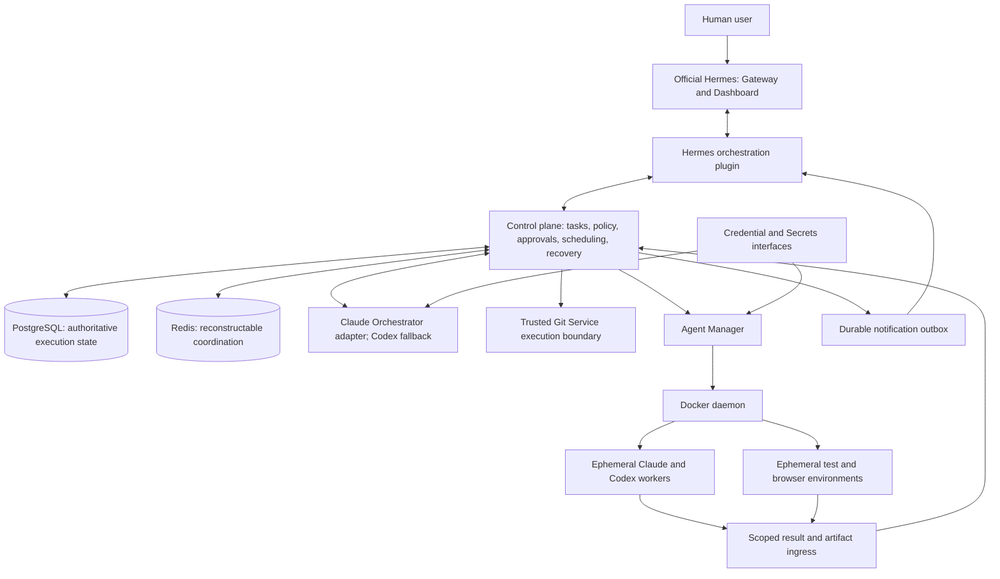

# Phase 0: Discovery

**Research date:** 2026-09-30 (Australia/Perth)  
**Status:** Documentation and source discovery complete; awaiting human approval to proceed to Phase 1.  
**Scope:** Sections 2, 3, 20, 87, 88, and 95 of [MASTER_SPEC.md](MASTER_SPEC.md). This report proposes an architecture; it does not claim that the platform, authentication flows, or container integrations have been implemented or runtime-tested.

## 1. Recommendation

Keep official Hermes unmodified as the communication, administration, skills, and plugin host. Add an external control plane for the stricter execution, authorization, and durability requirements in this specification. Agent Manager alone controls development and test containers. Claude Code remains the preferred logical task leader; Codex provides development, cross-review, and checkpoint-based leadership fallback.

Hermes already has projects, Kanban boards, task dependencies, review handoffs, worktrees, concurrency limits, worker recovery, and a Codex runtime. These are **partial matches**, not missing features. Their local process/SQLite execution model does not by itself meet the requested Docker lifecycle authority, PostgreSQL execution state, project isolation, or approved-merge completion contract. Reuse their interface and integration mechanisms where compatible; do not run two independent dispatchers for the same task.

The proposed integration uses a Hermes plugin, authenticated control-plane calls, and a Dashboard extension. Whether the native Kanban UI can safely display externally owned tasks without exposing native execution actions is an explicit Phase 1 compatibility decision, not an assumed supported interface.

## 2. Evidence and Version Baseline

### Verified upstream snapshot

| Item | Observed value | Verification |
| --- | --- | --- |
| Official source | `NousResearch/hermes-agent` | Official documentation links to this repository. |
| Latest release returned during research | `v2026.9.24`, titled Hermes Agent `v0.21.5` | [Release page](https://github.com/NousResearch/hermes-agent/releases/tag/v2026.9.24). |
| Inspected source commit | `f97608f178d1ffeca59860195ab7da295f7c8e5f` | Shallow release checkout; `git rev-parse HEAD`; `pyproject.toml` reports `0.21.5`. |
| Official image repository | `docker.io/nousresearch/hermes-agent` | Docker documentation and release workflow. |
| Inspected image tag | `v2026.9.24` | Read-only registry inspection with `docker buildx imagetools inspect`. |
| OCI index digest | `sha256:fca358f12efd65bfaaca05884166f15c0e2788375ca30d77061ac1ebc96452b7` | Registry response; contains both required Linux architectures. |
| AMD64 image manifest | `sha256:2fd023efbb8d3d2b0ce1a73d028b07370cff34f567cfe0e999553e8c327ea283` | `linux/amd64` entry. |
| ARM64 image manifest | `sha256:93b4e2877a2f48f4474b6dd2b99386ae32c4c552d32639df1a869b3f13c50b5a` | `linux/arm64` entry. |

The digest is a **candidate for validation**, not a tested production pin. Registry metadata confirms availability and platform entries, not boot success, provenance-label agreement, authentication, or compatibility with our plugin. The additional `unknown/unknown` entries are attestation manifests, not target architectures.

Live documentation can be newer than this release. The inspected release workflow publishes release-name tags and advances `main`/`latest` on main pushes; current Docker documentation describes a newer stable-promotion mechanism. The release source also declares Python `>=3.11,<3.14`, while current Docker documentation describes Python 3.14. Never combine current documentation and older release behavior without a compatibility check. [Current Docker documentation](https://hermes-agent.nousresearch.com/docs/user-guide/docker), [inspected release workflow](https://github.com/NousResearch/hermes-agent/blob/f97608f178d1ffeca59860195ab7da295f7c8e5f/.github/workflows/docker.yml), [release package metadata](https://github.com/NousResearch/hermes-agent/blob/f97608f178d1ffeca59860195ab7da295f7c8e5f/pyproject.toml).

The [source inventory](docs/discovery/source-inventory.json) records inspected source paths, immutable URLs, SHA-256 hashes, and image metadata. Upstream code was inspected in temporary directories, not copied into this project or executed. No provider credentials were read, exported, or used for a model request.

### Verification boundaries

- Confirmed: official documentation, release source, extension signatures, native execution ownership, and image manifest/platform metadata.
- Not performed: image pull/start, provider login, authenticated model calls, plugin installation, cross-platform smoke tests, or a GitHub merge.
- Local prerequisite observation: Docker and Codex executables were found; `claude` and `gh` were not found on the current shell PATH. That does not establish whether they exist elsewhere. Installation belongs to later phases.
- No Claude/Codex production version is selected yet. Phase 4 must record exact versions and test the documented contracts against those binaries; Phase 11 must test updates and rollback.

## 3. Hermes Capabilities and Integration Surface

### Core, Gateway, skills, and MCP

Hermes has an agent runtime, session storage, a messaging Gateway, tools, skills, and MCP integration. Preserve its own state and administration instead of moving its internal tables into our PostgreSQL database. Our PostgreSQL owns only the extended orchestration domain. [Architecture](https://hermes-agent.nousresearch.com/docs/developer-guide/architecture).

Reuse the official skill system for operator guidance and orchestration workflows. A skill is not an authorization boundary. Use the existing MCP client when exposing approved control-plane tools is useful; do not add an MCP server merely to wrap every internal component. [Skills](https://hermes-agent.nousresearch.com/docs/user-guide/features/skills), [MCP](https://hermes-agent.nousresearch.com/docs/user-guide/features/mcp).

### Verified plugin contracts

The release implements directory plugins with `plugin.yaml`, `__init__.py`, and `register(ctx)`. Relevant methods include `register_tool`, `register_hook`, `register_cli_command`, and `register_command`. The latter registers slash commands separately from CLI subcommands. Names must avoid native-command collisions. These are suitable for a namespaced orchestration integration; no fork is required. [Plugin guide](https://hermes-agent.nousresearch.com/docs/developer-guide/plugins), [release implementation](https://github.com/NousResearch/hermes-agent/blob/f97608f178d1ffeca59860195ab7da295f7c8e5f/hermes_cli/plugins.py).

Hooks can observe lifecycle events, but observation is not permission enforcement. For example, the release's Kanban hooks run around already-owned native lifecycle operations; registering an observer does not redirect container creation through Agent Manager. Control-plane authorization must be enforced by the service that performs the action.

### Dashboard

The native Dashboard already owns configuration, credentials, sessions, logs, skills, and general administration. Dashboard plugins have their own manifest, frontend entry, and optional FastAPI `router`; backend routes mount under `/api/plugins/<name>/`. Supported extension mechanisms include tabs and page slots. Extend this shell, rather than replacing it with a separate administration application. [Dashboard extension contract at the inspected release](https://github.com/NousResearch/hermes-agent/blob/f97608f178d1ffeca59860195ab7da295f7c8e5f/website/docs/user-guide/features/extending-the-dashboard.md).

**Documentation conflict:** The live Kanban page says plugin routes bypass authentication, but the inspected release's Dashboard middleware protects `/api/` except its explicit public allowlist; `/api/plugins/` is not a blanket exception. The release Dashboard extension guide also states plugin APIs use the normal authentication gate. Treat the Kanban wording as inconsistent documentation, not proof of an exploitable release behavior. Verify authentication and disabled-plugin behavior in runtime tests before exposing our routes. [Kanban page](https://hermes-agent.nousresearch.com/docs/user-guide/features/kanban), [middleware](https://github.com/NousResearch/hermes-agent/blob/f97608f178d1ffeca59860195ab7da295f7c8e5f/hermes_cli/web_server.py), [public-path allowlist](https://github.com/NousResearch/hermes-agent/blob/f97608f178d1ffeca59860195ab7da295f7c8e5f/hermes_cli/dashboard_auth/public_paths.py).

### Kanban, projects, reviews, dependencies, and workers

The inspected release already provides the following building blocks:

| Native capability | Implication for this project |
| --- | --- |
| Per-board SQLite tasks, comments, events, and runs | Useful collaboration model, but not our PostgreSQL execution authority. |
| Dependency links and readiness promotion | Reuse concepts and compatible presentation; avoid a second scheduling authority. |
| Named-profile workers launched as local subprocesses | Does not satisfy mandatory Agent Manager container ownership. |
| Global/per-profile in-progress limits and claim recovery | Partial scheduling/recovery support; add machine budgets, conflict handling, and fenced leadership externally. |
| Worktree workspaces | Useful reference, but Git Service must own our worktree lifecycle and protect human changes. |
| Review request and change-request transitions | Does not automatically enforce opposite-provider review or approved merge. |
| First-class projects with folders and board association | Map to existing Hermes project identities where possible; add approved registration and grants externally. |
| Completion contracts with PR check evidence | Does not replace our final human merge approval and post-merge verification. |

Evidence: [Kanban source](https://github.com/NousResearch/hermes-agent/blob/f97608f178d1ffeca59860195ab7da295f7c8e5f/hermes_cli/kanban_db.py), [dispatcher](https://github.com/NousResearch/hermes-agent/blob/f97608f178d1ffeca59860195ab7da295f7c8e5f/hermes_cli/kanban_db_dispatch.py), [project store](https://github.com/NousResearch/hermes-agent/blob/f97608f178d1ffeca59860195ab7da295f7c8e5f/hermes_cli/projects_db.py), [PR acceptance implementation](https://github.com/NousResearch/hermes-agent/blob/f97608f178d1ffeca59860195ab7da295f7c8e5f/hermes_cli/kanban_pr_acceptance.py).

`dispatch_once(..., spawn_fn=...)` exists in source, but its default launcher invokes `hermes -p <profile> chat -q ...` and tracks host PIDs. A Python injection parameter is not an established public plugin registration contract for external Docker lanes. Official worker-lane documentation explicitly leaves external CLI integration to additional design work. Do not invent `register_worker_lane()` or assume container IDs are valid host PIDs. [Worker lanes](https://hermes-agent.nousresearch.com/docs/user-guide/features/kanban-worker-lanes).

For the dedicated orchestration Hermes deployment, the initial proposal disables native Gateway dispatch using the verified `kanban.dispatch_in_gateway` setting, grants Hermes no Docker access, and routes platform tasks through the integration. This setting alone is insufficient: phase validation must also prevent native tools, CLI entry points, cron, or Dashboard actions from launching alternate execution paths.

### Existing Claude and Codex integrations

Hermes includes a Claude Code skill that describes driving the official CLI. That is useful workflow guidance, not a persistent Claude leader, a Credential Broker, or Docker lifecycle enforcement. Inspect it as upstream behavior, not as permission to bypass project policy. [Bundled skill source](https://github.com/NousResearch/hermes-agent/blob/f97608f178d1ffeca59860195ab7da295f7c8e5f/skills/autonomous-ai-agents/claude-code/SKILL.md).

Hermes also has an optional Codex app-server runtime with tool bridging and approval presentation. Its documented limits include separate Hermes/Codex authentication and unavailable Hermes tools in that runtime. It is a candidate for interface reuse, but it does not supply the independent container-worker contract or full leadership failover required here. Start our adapter design with documented CLI execution; evaluate app-server only where it provides a concrete required benefit. [Codex runtime](https://hermes-agent.nousresearch.com/docs/user-guide/features/codex-app-server-runtime).

### Notifications and webhooks

Use Hermes delivery mechanisms. The release documents `hermes send` for one-shot delivery and webhook routes with HMAC validation and `deliver_only` for notifications without an agent turn. Put durable delivery events in our outbox and retry through this integration when Hermes recovers. Do not add n8n or Evolution API. A verified webhook sender is not a verified human approval; approval still needs the authenticated principal and exact action binding. [Release CLI reference](https://github.com/NousResearch/hermes-agent/blob/f97608f178d1ffeca59860195ab7da295f7c8e5f/website/docs/reference/cli-commands.md), [release webhook guide](https://github.com/NousResearch/hermes-agent/blob/f97608f178d1ffeca59860195ab7da295f7c8e5f/website/docs/user-guide/messaging/webhooks.md).

## 4. Provider Authentication and Execution

### Claude Code

Official documentation supports subscription login through the CLI. It documents macOS Keychain storage and Linux `.credentials.json` under the Claude configuration directory; `CLAUDE_CONFIG_DIR` separates configurations. Containerized Linux cannot be assumed to read the host macOS Keychain. The credential path is documented, but copying a personal host configuration wholesale is not the proposed broker design. [Authentication](https://code.claude.com/docs/en/authentication).

The CLI reference documents `claude setup-token` for subscription-backed script credentials; it prints a token rather than saving it. This is an alternative to evaluate during secure bootstrap, not a command to run through ordinary captured logs. [CLI reference](https://code.claude.com/docs/en/cli-reference).

`claude -p` supports programmatic execution, JSON/stream output, and session continuation. Current documentation says `--bare` skips OAuth/Keychain and requires another supported credential path; it cannot be our default subscription worker mode. Normal print mode may load repository hooks and MCP configuration without interactive trust prompts. Therefore Phase 4 must verify a controlled configuration/trust policy for the chosen CLI version before running repository content. [Programmatic execution](https://code.claude.com/docs/en/headless).

**Proposed broker behavior:** bootstrap a dedicated provider identity/configuration, supply only that provider's required material to authorized executions, exclude it from backups/artifacts, and treat revocation/expiry as `AUTH_REQUIRED`. Validate renewal and concurrent-process behavior before sharing a credential lineage across workers. Do not implement undocumented OAuth refresh endpoints.

### Codex CLI

Official documentation supports ChatGPT login and device-code login for headless environments where enabled. Cached credentials use an OS store or `auth.json` under the Codex configuration home, controlled by `cli_auth_credentials_store`. Codex refreshes account credentials during use. The documented file-copy fallback does not make a shared personal directory safe for unrelated workers. [Authentication](https://learn.chatgpt.com/docs/auth).

`codex exec` reuses saved authentication, supports JSONL events and schema-constrained final output, and can resume an explicit session ID. Its event stream can contain reasoning items: our adapter must allowlist operational evidence and must not persist raw streams as task artifacts. Official documentation recommends API keys as the default for automation and limits the advanced account-auth CI workflow to trusted contexts. Subscription-first remains the requested design, with container/session persistence validation still required. [Non-interactive execution](https://learn.chatgpt.com/docs/non-interactive-mode).

**Proposed broker behavior:** separate managed Codex credentials from Hermes provider credentials and other projects; coordinate refresh writes; record opaque credential references, not tokens. If supported session persistence cannot satisfy the chosen trust boundary, stop that execution with a documented limitation rather than silently substituting API billing or weakening isolation.

### GitHub CLI

`gh auth login` supports browser authentication and persistent storage, with plaintext fallback when a credential store is unavailable. Keep this identity exclusively in the trusted Git Service execution boundary. Do not mount it into Hermes development tools or worker containers. [Login reference](https://cli.github.com/manual/gh_auth_login).

Verified command surfaces include `gh pr create`, `gh pr checks`, and `gh pr merge`. A successful PR creation is not approval. After the Approval Service authorizes an action, Git Service can bind a merge to the approved PR head using `--match-head-commit`; it must also revalidate base, policy, checks, and approval scope. Merge queues need separate reconciliation before reporting success. Never use `--admin` or enable automatic merging as a substitute for approval. Local repositories need the same approval rule without GitHub. [PR creation](https://cli.github.com/manual/gh_pr_create), [checks](https://cli.github.com/manual/gh_pr_checks), [merge](https://cli.github.com/manual/gh_pr_merge).

### Conceptual commands are not existing interfaces

The specification's `hermes auth login claude`, `hermes auth login codex`, `hermes task ...`, and `hermes project add ...` examples are conceptual. They must not be presented as working upstream commands. The inspected native project command already uses a `create` operation and manages its own project records. Prefer a plugin namespace such as `hermes orchestration ...` for new operations, subject to collision checks, while preserving native commands. Exact new syntax and API routes belong to Phase 1/2. [Native project parser](https://github.com/NousResearch/hermes-agent/blob/f97608f178d1ffeca59860195ab7da295f7c8e5f/hermes_cli/projects_cmd.py).

## 5. Component Responsibility Matrix

**YES** means reuse/integrate; **PARTIAL** means extend compatible behavior; **NO** means implement externally because no equivalent satisfying this specification was found in the inspected surfaces. A NO result is a scoped discovery finding, not a claim that no future Hermes release could provide it.

| Proposed responsibility | Hermes coverage | Decision and owner | Evidence / gap |
| --- | --- | --- | --- |
| Gateway and channels | YES | Reuse official Hermes. | Existing messaging and delivery. |
| General administration Dashboard | YES | Reuse official Hermes. | Native administration plus plugin shell. |
| Skills, plugins, hooks, MCP | YES | Reuse official extension contracts. | Verified plugin methods and docs. |
| Notifications and webhook ingress | YES | Reuse transport; control plane owns durable outbox. | Existing send/webhook mechanisms. |
| Project Registry | PARTIAL | Map Hermes project identity; control plane owns approved paths/configuration/grants. | Native folders/boards lack the full required admission policy. |
| Onboarding and configuration drift | PARTIAL | Extend discovery/context features with approved proposals and drift checks. | Explicit PROJECT_READY and sensitive-change approval needed. |
| Task API and lifecycle | PARTIAL | Control plane owns execution state; Hermes exposes commands/views. | Native board states do not encode all required completion conditions. |
| DAG and task relationships | PARTIAL | Reuse board presentation where safe; control plane owns execution dependencies. | Native links exist; budget/scope/revision rules differ. |
| Scheduler | PARTIAL | Extend externally for priority, conflict analysis, resource budgets, and safe preemption. | Native process dispatcher/concurrency is narrower. |
| Persistent Claude leader | NO | Dedicated orchestration adapter supervised by control plane. | Claude skill is not the requested leader service. |
| Claude/Codex AgentAdapter | PARTIAL | Reuse official CLIs/runtime knowledge; implement normalized worker contracts. | No verified ready-made external Docker lane. |
| Scored routing | PARTIAL | Control plane routes using measured operational data. | Profile assignment is not the complete scoring policy. |
| Agent Manager | NO | Isolated trusted Docker lifecycle authority. | Native process/Docker backends have different ownership. |
| Capability Grants | PARTIAL | Policy Engine and Agent Manager own worker grants. | Hermes plugin permissions do not cover our container grants. |
| Project isolation | PARTIAL | Agent Manager/Git Service enforce mounts, networks, caches, and credentials. | Boards/profiles are not sufficient OS security boundaries. |
| Policy Engine | PARTIAL | Extend with immutable server-side policies. | Native tool approvals are not complete hard policy enforcement. |
| Approval Service | PARTIAL | Reuse presentation; control plane owns action/hash/principal records. | Session-level tool consent is not merge authorization. |
| Credential Broker | PARTIAL | Provider-owned login plus a dedicated secure lifecycle interface. | Existing provider auth does not prove concurrent ephemeral-worker safety. |
| Secrets Broker | PARTIAL | Integrate native secret facilities only where compatible; add scoped delivery. | Project/task/environment/capability authorization required. |
| Git Service and human change protection | PARTIAL | Dedicated trusted Git execution boundary. | Native worktrees/PR checks lack full approved-merge ownership. |
| Cross-review | PARTIAL | Reuse review concepts; enforce opposite-provider and no self-approval. | Native review handoff alone does not enforce provider separation. |
| Test/Browser Runners | PARTIAL | Agent Manager creates dedicated isolated runners. | Existing execution/browser tools do not establish required test isolation. |
| Quality Gate | PARTIAL | Control plane evaluates configured evidence and hard policy. | Native completion/PR checks are only part of required evidence. |
| Recovery and leader failover | PARTIAL | Control plane owns checkpoints, fencing, reconciliation, and provider handoff. | Native PID/claim recovery is not a distributed leader lease. |
| Budgets and task expansion | PARTIAL | Control plane accounts for runtime, launches, retries, usage, and scope. | Native iteration/concurrency controls are insufficient. |
| Knowledge Service | PARTIAL | Reuse Hermes memory interfaces; add project-scoped provenance and trust states. | Avoid duplicating generic conversation memory. |
| Task Manifest and artifact/audit layer | PARTIAL | Add sanitized reproducibility records and durable artifacts. | Native comments/runs/logs are useful but not the complete manifest. |
| PostgreSQL/Redis orchestration storage | NO | External persistent/coordination stores. | Native Hermes storage remains separate. |
| Orchestration Dashboard views | PARTIAL | Extend existing Dashboard; validate board reuse before custom task views. | Extra budgets, approvals, gates, and audit presentation needed. |
| Backups, retention, updates, and rollback | PARTIAL | Extend native operations with coordinated checkpoints and validation. | Whole-volume copying would include credentials. |
| Machine/toolchain profiles and caches | PARTIAL | Versioned external worker images and per-machine policies. | Official Hermes image is not every project toolchain. |

This matrix is supported by the inspected source paths in the inventory and the capability/authentication findings above. Phase 1 must revisit any PARTIAL component before approving a custom replacement.

## 6. Proposed Architecture

This is the Phase 0 proposal requested by section 95, not the completed Phase 1 architecture package.

### Deployment and ownership

Start with five persistent service roles: Hermes, control plane, Agent Manager, PostgreSQL, and Redis. The persistent orchestrator supervisor can live in the control-plane deployment with Claude itself in a restricted child/container boundary. Split a dedicated orchestrator service only if necessary to enforce access or supervise it reliably. Git Service is a logical component but credential-bearing Git execution must remain inaccessible to model-controlled commands. Phase 1 must decide its concrete process/container boundary.

The Credential/Secrets interfaces are not permission to put raw secrets in every control-plane process. Their implementations should minimize secret exposure. macOS Keychain access may require a narrowly scoped host-side helper; a Linux container cannot simply mount the host Keychain. Prefer dedicated Linux-managed provider sessions if a host helper is unnecessary.

Registered source repositories and task worktrees remain on the host. Hermes SQLite state should use container-native storage on Docker Desktop, or a verified supported journaling configuration. The inspected Docker guide documents WAL hazards on VM-crossing filesystem mounts. Host-source availability and database-storage safety are separate concerns. Back up only an explicit allowlist of non-secret Hermes state, not its whole data directory. [Release Docker guide](https://github.com/NousResearch/hermes-agent/blob/f97608f178d1ffeca59860195ab7da295f7c8e5f/website/docs/user-guide/docker.md).

### Single ownership of task execution

1. Hermes submits a task request to the authenticated integration with a project identity and an idempotency key.
2. The control plane persists requirements and scope, then schedules a leased planning/execution step.
3. Claude proposes a plan or action; the Policy Engine decides what may execute. Claude never self-grants.
4. Agent Manager creates a worker only after verifying authorization, budget, resource limits, image allowlist, mounts, and network grants.
5. Results pass through scoped ingestion and schema validation; workers cannot access PostgreSQL, Redis, the Docker daemon, or peers directly.
6. Tests, independent cross-review, and Quality Gate evidence precede `READY_FOR_MERGE`.
7. An authenticated human approves the exact merge action and relevant state. Git Service revalidates and performs it; post-merge checks precede `DONE`.

Use durable intent/outbox records and idempotent reconciliation for database-to-Docker/Git operations. Redis locks alone are insufficient. Lease epochs/fencing prevent a resumed old leader or worker from completing a newer execution attempt.

### Hermes board integration decision

PostgreSQL is authoritative for platform execution; native Hermes SQLite remains authoritative only for native Hermes data. Do not write both databases as independent sources of the same task state.

Phase 1 must validate either a safe native-board projection through supported interfaces or a narrow Dashboard extension backed directly by the Task API. Native UI mutations must become validated task commands, never direct grants or final completion. If the native board cannot meet that contract without private monkey-patches, document the missing capability and reuse the Dashboard shell with a dedicated orchestration view. Do not silently mark native `review` as merge approval or native `done` as post-merge completion.

### Enforcement beyond agent instructions

Container mounts, service identities, protected Git operations, network isolation, and resource limits enforce hard boundaries. Prompts, skill text, CLI allowlists, and hooks are supplementary controls. Phase 1 must specify how command execution, untrusted repository hooks, and credential-bearing CLI processes are separated or mediated; a model with unrestricted shell access can otherwise evade a command classifier. This is a design acceptance condition before worker implementation.

## 7. Conflicts and Required Decisions

| ID | Conflict / limitation | Proposed resolution | Validation phase |
| --- | --- | --- | --- |
| D01 | Native dispatch launches Hermes subprocesses; Agent Manager must own workers. | Disable native platform-task dispatch; use a verified plugin/API bridge. | 1, 3, 9 |
| D02 | Native SQLite boards overlap required PostgreSQL task state. | One execution authority; explicit projection/identity mapping or minimal Dashboard extension. | 1, 2, 9, 10 |
| D03 | Native completion/review does not mean approved and verified merge. | Separate execution states; enforce human action and post-merge evidence externally. | 1, 5, 7 |
| D04 | Worker-lane injection exists in Python, but is not a paved external CLI plugin API. | No invented lane registration or PID/container equivalence. | 1, 3, 4 |
| D05 | Claude `--bare` conflicts with subscription authentication. | Version-tested normal CLI mode with controlled configuration; document any unresolved trust restriction. | 1, 4 |
| D06 | Host Keychain and container credential storage differ; concurrent refresh behavior is untested. | Dedicated broker-managed sessions and renewal/concurrency tests. | 1, 4 |
| D07 | Live Docker documentation differs from release workflow/runtime. | Pin inspected source and registry digest only after image tests; do not use moving tags. | 2, 4, 11 |
| D08 | Dashboard authentication statements conflict across docs. | Follow inspected middleware, then test real unauthorized requests. | 1, 9, 11 |
| D09 | Source files must remain on host; SQLite WAL is unsafe on some VM-shared mounts. | Separate source bind mounts from native database volumes. | 1, 2, 8, 11 |
| D10 | Conceptual commands overlap existing native CLI names. | Use verified namespaced extension commands and native identity mapping. | 1, 2, 9 |
| D11 | Provider JSON streams/logs may include reasoning or sensitive content. | Allowlist sanitized operational events before persistence. | 1, 4, 7, 11 |
| D12 | Hermes state directories can include credentials but normal backups must exclude them. | Explicit backup allowlist, secure credential backend, restore validation. | 1, 11 |
| D13 | Subscription-based automation is not proof of safe credential reuse in arbitrary repository execution. | Validate trusted execution assumptions; block unsupported flows rather than silently changing billing/auth. | 1, 4, 11 |
| D14 | An available tool hook or model policy is not a hard execution boundary. | Specify enforceable command, filesystem, network, secret, and Git boundaries. | 1, 3, 4, 11 |

These are implementation/design decisions, not silent changes to `MASTER_SPEC.md`. No hard rule is relaxed by this proposal.

## 8. Exit Evidence and Next Phase

- [x] Reviewed current official Hermes documentation and a specific stable release checkout.
- [x] Identified existing capabilities, extension surfaces, and overlaps.
- [x] Verified image registry identity, digest, and ARM64/AMD64 manifest entries.
- [x] Verified documented Claude Code, Codex CLI, and GitHub CLI authentication/execution behavior.
- [x] Produced a component responsibility matrix and proposed architecture.
- [x] Recorded contradictions, unsupported assumptions, and runtime validation limits.
- [x] Created a source inventory with immutable references and file hashes.
- [ ] Obtain explicit user approval to proceed beyond Phase 0.

After approval, Phase 1 produces `ARCHITECTURE.md`, `SECURITY_MODEL.md`, `DATA_MODEL.md`, and `NETWORK_MODEL.md`. Its first decisions are task/board ownership, credential and Git execution boundaries, enforceable command policy, and the precise Hermes extension contract. Runtime proof belongs to the relevant implementation phases; it has not been replaced by this document.

The stop is required by [MASTER_SPEC.md, section 95](MASTER_SPEC.md#95-first-action): “STOP after Phase 0 and wait for explicit user approval before implementation.”
