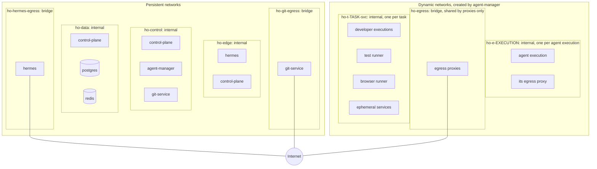

# Network Model

**Phase:** 1 (Architecture)  
**Status:** Approved by Gabriel Paredes on 2026-09-30 (PR #2)  
**Inputs:** [MASTER_SPEC.md](MASTER_SPEC.md) sections 13, 51–55, 62, 82  
**Related:** [ARCHITECTURE.md](ARCHITECTURE.md), [SECURITY_MODEL.md](SECURITY_MODEL.md)

## 1. Goals

1. Workers cannot reach PostgreSQL, Redis, the Docker daemon, Git Service, the control plane, other tasks' containers, or other projects' services (§62).
2. Test runners have no Internet access by default (§53).
3. Development and orchestrator executions have configurable egress, from provider-only to general public Internet (§54). Every mode goes through a single enforcement point that blocks private and host addresses.
4. No platform API is published on a non-loopback host interface by default.
5. The same model works on Docker Desktop for macOS (Apple Silicon) and Docker Engine on Linux.

## 2. Topology

Nodes that appear more than once are the same container attached to several networks (for example `hermes` is on `ho-hermes-egress` and `ho-edge`).

## 3. Persistent Networks

| Network | Driver / `internal` | Members | Purpose |
| --- | --- | --- | --- |
| `ho-hermes-egress` | bridge / no | hermes | Hermes model providers and messaging channels |
| `ho-edge` | bridge / yes | hermes, control-plane | Plugin → Task API; control plane → Hermes webhook |
| `ho-control` | bridge / yes | control-plane, agent-manager, git-service | Private service APIs |
| `ho-data` | bridge / yes | control-plane, postgres, redis | Databases reachable only by the control plane |
| `ho-git-egress` | bridge / no | git-service | GitHub over HTTPS |

`agent-manager` has no Internet access. Image pulls are performed by the Docker daemon, not by the agent-manager container. `control-plane` has no Internet access. Update detection (§3, §19) runs in a component with egress. Phase 11 chooses between Git Service and a host-side operator script.

## 4. Dynamic Networks

Agent Manager creates these networks on demand. Labels (`ho.task`, `ho.project`, `ho.execution`) allow reconciliation.

| Network | `internal` | Members | Lifetime | Purpose |
| --- | --- | --- | --- | --- |
| `ho-e-<execution>` | yes | One agent execution and its own egress proxy | The execution | The execution reaches the Internet only through its proxy |
| `ho-egress` | no | Egress proxies only | Shared, persistent | The proxies' route out |
| `ho-t-<task>-svc` | yes | Executions with `test_services`, test and browser runners, ephemeral services, project Compose services | The task | Private test services; no Internet (§51, §53) |

**Change from the Phase 1 design (made in Phase 3):** the design had one agent network and one proxy per task. Executions of the same task can hold different egress grants (a reviewer is `PROVIDER_ONLY` while the developer is `STANDARD`), and a shared proxy could only enforce one policy. Each agent execution therefore gets its own internal network and its own proxy, configured from that execution's grant. The proxies share the `ho-egress` bridge; a proxy refuses private destinations, so it cannot be used to reach another proxy or anything else on that bridge.

Two tasks never share an internal network, so containers of different tasks or projects cannot reach each other.

The test runner and browser runner attach only to `ho-t-<task>-svc`. They have no route to the Internet, the proxy, or the host.

## 5. Egress Modes

All egress from agent executions passes through the execution's egress proxy. Workers get `HTTPS_PROXY`/`HTTP_PROXY`/`NO_PROXY` environment variables pointing at the proxy's IP address. Direct connections fail because `ho-e-<execution>` is internal. Workers use `127.0.0.1` as their only DNS server, so they cannot resolve external names at all; the proxy resolves destinations. Tools that ignore proxy settings lose network access; this is intended.

The capability grant expresses this as `network.egress` plus a separate `network.test_services` flag, which attaches the execution to `ho-t-<task>-svc` ([schemas/capability.schema.json](schemas/capability.schema.json)). An agent execution never has `NONE` egress: it needs at least its provider's API, so the Policy Engine raises it to `PROVIDER_ONLY`.

| `network.egress` | Allowed destinations | Typical roles |
| --- | --- | --- |
| `NONE` | No Internet. With `test_services: true`, only `ho-t-<task>-svc`; otherwise no network | Test runner, browser runner |
| `PROVIDER_ONLY` | The provider API endpoints of the execution's provider | Reviewer; orchestrator and developer in `provider_only` projects |
| `ALLOWLIST` | Provider endpoints + project `network.allowed_domains` + research presets enabled by the project (official documentation, package registries, public GitHub) | Developer and orchestrator in `restricted` projects that need docs or packages |
| `STANDARD` | Any public destination | Developer and orchestrator in `standard` projects (§54 default) |

Rules enforced by the proxy in every mode:

- Deny private, loopback, link-local, and unique-local ranges after DNS resolution: `10.0.0.0/8`, `172.16.0.0/12`, `192.168.0.0/16`, `127.0.0.0/8`, `169.254.0.0/16`, `100.64.0.0/10`, `::1/128`, `fc00::/7`, `fe80::/10`. This blocks the host, Docker Desktop's VM network, cloud metadata services, and the LAN.
- Deny `host.docker.internal`, `gateway.docker.internal`, and other names that resolve to the ranges above.
- Deny destinations listed as production in the project's `environments` configuration. (Unlocking them with an approved `PROD_READ`/`PROD_WRITE` grant arrives with environment access in Phase 4; until then production hosts are always denied.)
- Accept only `CONNECT host:443`. Plain HTTP requests, other ports, and IP-literal destinations are refused.
- Connect to the address that was checked; the name is not resolved twice, so DNS rebinding cannot redirect the connection.
- Log destination host, port, bytes, and decision per execution. Agent Manager returns these logs with the execution's output and the control plane stores them as the `egress.jsonl` artifact for provenance (§54) and audit.

Provider API endpoints are not hardcoded here. Phase 4 records them from each provider's official network documentation for the pinned CLI version. They are kept in the machine profile, not in project configuration.

**Phase 4:** recorded in `config/defaults.yaml` (`machine.provider_domains`):

| Provider | Hosts | Source |
| --- | --- | --- |
| Claude Code | `api.anthropic.com`, `claude.ai`, `platform.claude.com` | [Claude Code network access requirements](https://code.claude.com/docs/en/network-config#network-access-requirements) (API, claude.ai authentication, OAuth token exchange and refresh) |
| Codex CLI | `chatgpt.com`, `auth.openai.com`, `api.openai.com` | [Codex agent approvals and security](https://learn.chatgpt.com/docs/agent-approvals-security) |

Hosts for telemetry, error reporting, plugins, and updates are deliberately left out; the images disable automatic updates, and Claude Code runs with `CLAUDE_CODE_DISABLE_NONESSENTIAL_TRAFFIC=1`. Real runs of both pinned CLIs through a `PROVIDER_ONLY` proxy (invalid logins, so no model request succeeded) contacted only listed hosts: Claude Code `api.anthropic.com`; Codex `chatgpt.com` and `auth.openai.com` ([docs/validation/phase-4.md](docs/validation/phase-4.md)).

**OI-05 (resolved in Phase 3):** the proxy is a small purpose-built service, [services/egress-proxy](services/egress-proxy/) (about 200 lines, standard library only), rather than a general proxy such as Squid. It implements exactly the rules above and nothing else, which keeps its behavior easy to review and test. It runs non-root with the same container baseline as workers (SECURITY_MODEL §8.1), 64 MiB of memory, and 0.25 CPU.

## 6. Access Matrix

"Yes" means a network path exists; authentication is still required where applicable.

| From ↓ / To → | hermes | control-plane | agent-manager | git-service | postgres / redis | Docker API | Internet | Other task's containers |
| --- | --- | --- | --- | --- | --- | --- | --- | --- |
| hermes | — | Yes (Task API) | No | No | No | No | Yes | No |
| control-plane | Yes (webhook) | — | Yes | Yes | Yes | No | No | No |
| agent-manager | No | Yes (responses only) | — | No | No | Yes (socket) | No | No |
| git-service | No | Yes (responses only) | No | — | No | No | GitHub | No |
| Orchestrator / developer / reviewer | No | No | No | No | No | No | Through proxy only | No |
| Test / browser runner | No | No | No | No | No | No | No | No |
| Ephemeral services | No | No | No | No | No | No | No | No |

## 7. Host Exposure

| Port | Service | Default binding | Notes |
| --- | --- | --- | --- |
| Hermes Dashboard | hermes | `127.0.0.1` only | Remote access through an SSH tunnel or a reverse proxy the operator configures |
| Hermes gateway inbound (webhook platforms) | hermes | Not published unless a channel requires it | Configured per channel |
| Task API | control-plane | Not published | Host operator CLI uses `docker compose exec control-plane ...` |
| postgres, redis, agent-manager, git-service | — | Never published | |
| Ephemeral and project services | — | Never published | Generated Compose overrides strip `ports:` |

## 8. Project Compose Integration

For a project with its own Compose files (§52), the control plane renders an override under `<project>/.hermes/generated/<task>/` and Agent Manager runs the project's Compose with:

- a unique Compose project name `ho-<task>-<project-slug>`;
- every service attached to `ho-t-<task>-svc` only (declared as an external network); project-defined networks are mapped onto it;
- `ports:` removed, `network_mode: host` rejected, privileged services rejected, bind mounts restricted to the task workspace;
- cleanup of the Compose project and generated files after testing, unless retention says otherwise.

Agent Manager runs Compose through its own Docker access. The project's Compose files are input data, validated before use (SECURITY_MODEL §9 rule 7).

## 9. Platform Differences

| Topic | macOS (Docker Desktop, Apple Silicon) | Linux (Docker Engine) |
| --- | --- | --- |
| Architecture | `linux/arm64` images | `linux/amd64` or `linux/arm64` |
| Host access from containers | `host.docker.internal` resolves to the host | The bridge gateway IP reaches host services listening on all interfaces |
| Mitigation | Proxy deny rules; internal networks have no gateway | Same; optionally add host firewall rules for `docker0` in hardening |
| Bind mounts | Through the Docker Desktop file-sharing layer; the projects root must be in the shared paths | Native |
| SQLite databases | Keep Hermes SQLite on named volumes (D09) | Named volumes recommended for parity |

## 10. Verification Plan

Phase 3 implements these as automated tests; Phase 11 reruns them on both platforms. Phase 3 results (macOS, Docker Desktop): N01–N06 and N08 pass (`make test-docker`, `make smoke-phase3`); N07 needs project Compose support (Phase 6); N09 needs the Hermes service (Phase 9). See [docs/validation/phase-3.md](docs/validation/phase-3.md).

| ID | Test | Expected |
| --- | --- | --- |
| N01 | From a developer execution, connect to postgres, redis, control-plane, agent-manager, git-service by name and IP | Fails |
| N02 | From a developer execution, connect directly to a public IP without the proxy | Fails |
| N03 | Through the proxy, request `host.docker.internal`, the bridge gateway, `169.254.169.254`, and an RFC 1918 address | Denied and logged |
| N04 | Through the proxy in `PROVIDER_ONLY`, request a non-provider domain | Denied |
| N05 | From the test runner, resolve and connect to a public domain | Fails |
| N06 | From task A's container, reach task B's container or services | Fails |
| N07 | Project Compose override with `ports:` or `network_mode: host` | Rejected before start |
| N08 | DNS queries for arbitrary external names from internal networks | Fails. Workers use `127.0.0.1` as their DNS server, so Docker's embedded resolver has nowhere to forward external names (verified in Phase 3); names on attached internal networks still resolve. |
| N09 | Host port scan of published ports | Only loopback-bound Hermes ports |
