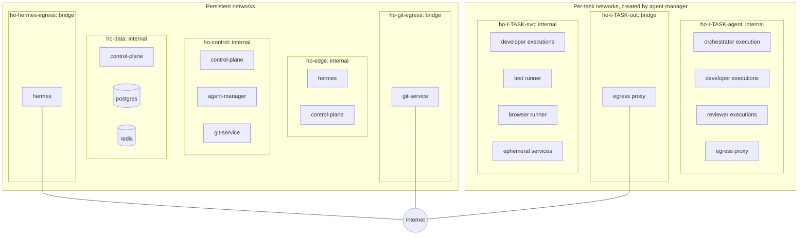

# Network Model

**Phase:** 1 (Architecture)  
**Status:** Draft for review  
**Inputs:** [MASTER_SPEC.md](MASTER_SPEC.md) sections 13, 51–55, 62, 82  
**Related:** [ARCHITECTURE.md](ARCHITECTURE.md), [SECURITY_MODEL.md](SECURITY_MODEL.md)

## 1. Goals

1. Workers cannot reach PostgreSQL, Redis, the Docker daemon, Git Service, the control plane, other tasks' containers, or other projects' services (§62).
2. Test runners have no Internet access by default (§53).
3. Development and orchestrator executions have configurable egress, from provider-only to general public Internet (§54). Every mode goes through a single enforcement point that blocks private and host addresses.
4. No platform API is published on a non-loopback host interface by default.
5. The same model works on Docker Desktop for macOS (Apple Silicon) and Docker Engine on Linux.

## 2. Topology

Nodes that appear more than once are the same container attached to several networks (for example `hermes` is on `ho-hermes-egress` and `ho-edge`).

## 3. Persistent Networks

| Network | Driver / `internal` | Members | Purpose |
| --- | --- | --- | --- |
| `ho-hermes-egress` | bridge / no | hermes | Hermes model providers and messaging channels |
| `ho-edge` | bridge / yes | hermes, control-plane | Plugin → Task API; control plane → Hermes webhook |
| `ho-control` | bridge / yes | control-plane, agent-manager, git-service | Private service APIs |
| `ho-data` | bridge / yes | control-plane, postgres, redis | Databases reachable only by the control plane |
| `ho-git-egress` | bridge / no | git-service | GitHub over HTTPS |

`agent-manager` has no Internet access. Image pulls are performed by the Docker daemon, not by the agent-manager container. `control-plane` has no Internet access. Update detection (§3, §19) runs in a component with egress. Phase 11 chooses between Git Service and a host-side operator script.

## 4. Per-Task Networks

Agent Manager creates these networks when a task first needs them and removes them when the task reaches a terminal state or its retention ends. Names include the task key. Labels (`ho.task`, `ho.project`) allow reconciliation.

| Network | `internal` | Members | Purpose |
| --- | --- | --- | --- |
| `ho-t-<task>-agent` | yes | Orchestrator, developer, and reviewer executions; the task's egress proxy | Agent executions reach the Internet only through the proxy |
| `ho-t-<task>-out` | no | The task's egress proxy only | The proxy's route out |
| `ho-t-<task>-svc` | yes | Developer executions (when services are needed), test runner, browser runner, ephemeral services, project Compose services | Private test services; no Internet (§51, §53) |

A task's networks belong to exactly one project. Two tasks never share a network, so containers of different tasks or projects cannot reach each other.

The test runner and browser runner attach only to `ho-t-<task>-svc`. They have no route to the Internet, the proxy, or the host.

## 5. Egress Modes

All egress from agent executions passes through the per-task egress proxy. Workers get `HTTPS_PROXY`/`HTTP_PROXY`/`NO_PROXY` environment variables. Direct connections fail because `ho-t-<task>-agent` is internal. Tools that ignore proxy settings lose network access; this is intended.

The capability grant expresses this as `network.egress` plus a separate `network.test_services` flag, which attaches the execution to `ho-t-<task>-svc` ([schemas/capability.schema.json](schemas/capability.schema.json)).

| `network.egress` | Allowed destinations | Typical roles |
| --- | --- | --- |
| `NONE` | No Internet. With `test_services: true`, only `ho-t-<task>-svc`; otherwise no network | Test runner, browser runner |
| `PROVIDER_ONLY` | The provider API endpoints of the execution's provider | Reviewer; orchestrator and developer in `provider_only` projects |
| `ALLOWLIST` | Provider endpoints + project `network.allowed_domains` + research presets enabled by the project (official documentation, package registries, public GitHub) | Developer and orchestrator in `restricted` projects that need docs or packages |
| `STANDARD` | Any public destination | Developer and orchestrator in `standard` projects (§54 default) |

Rules enforced by the proxy in every mode:

- Deny private, loopback, link-local, and unique-local ranges after DNS resolution: `10.0.0.0/8`, `172.16.0.0/12`, `192.168.0.0/16`, `127.0.0.0/8`, `169.254.0.0/16`, `100.64.0.0/10`, `::1/128`, `fc00::/7`, `fe80::/10`. This blocks the host, Docker Desktop's VM network, cloud metadata services, and the LAN.
- Deny `host.docker.internal`, `gateway.docker.internal`, and other names that resolve to the ranges above.
- Deny destinations listed as production in the project's `environments` configuration unless the execution holds an approved `PROD_READ` or `PROD_WRITE` grant.
- Log destination host, port, bytes, and decision per execution. The control plane ingests the logs for provenance (§54) and audit.

Provider API endpoints are not hardcoded here. Phase 4 records them from each provider's official network documentation for the pinned CLI version. They are kept in the machine profile, not in project configuration.

The proxy image and its allowlist mechanism are chosen in Phase 3 (OI-05). The proxy must support HTTP CONNECT, hostname allowlists, IP checks after resolution (to prevent DNS rebinding), and structured logs. It runs non-root with the same container baseline as workers (SECURITY_MODEL §8.1).

## 6. Access Matrix

"Yes" means a network path exists; authentication is still required where applicable.

| From ↓ / To → | hermes | control-plane | agent-manager | git-service | postgres / redis | Docker API | Internet | Other task's containers |
| --- | --- | --- | --- | --- | --- | --- | --- | --- |
| hermes | — | Yes (Task API) | No | No | No | No | Yes | No |
| control-plane | Yes (webhook) | — | Yes | Yes | Yes | No | No | No |
| agent-manager | No | Yes (responses only) | — | No | No | Yes (socket) | No | No |
| git-service | No | Yes (responses only) | No | — | No | No | GitHub | No |
| Orchestrator / developer / reviewer | No | No | No | No | No | No | Through proxy only | No |
| Test / browser runner | No | No | No | No | No | No | No | No |
| Ephemeral services | No | No | No | No | No | No | No | No |

## 7. Host Exposure

| Port | Service | Default binding | Notes |
| --- | --- | --- | --- |
| Hermes Dashboard | hermes | `127.0.0.1` only | Remote access through an SSH tunnel or a reverse proxy the operator configures |
| Hermes gateway inbound (webhook platforms) | hermes | Not published unless a channel requires it | Configured per channel |
| Task API | control-plane | Not published | Host operator CLI uses `docker compose exec control-plane ...` |
| postgres, redis, agent-manager, git-service | — | Never published | |
| Ephemeral and project services | — | Never published | Generated Compose overrides strip `ports:` |

## 8. Project Compose Integration

For a project with its own Compose files (§52), the control plane renders an override under `<project>/.hermes/generated/<task>/` and Agent Manager runs the project's Compose with:

- a unique Compose project name `ho-<task>-<project-slug>`;
- every service attached to `ho-t-<task>-svc` only (declared as an external network); project-defined networks are mapped onto it;
- `ports:` removed, `network_mode: host` rejected, privileged services rejected, bind mounts restricted to the task workspace;
- cleanup of the Compose project and generated files after testing, unless retention says otherwise.

Agent Manager runs Compose through its own Docker access. The project's Compose files are input data, validated before use (SECURITY_MODEL §9 rule 7).

## 9. Platform Differences

| Topic | macOS (Docker Desktop, Apple Silicon) | Linux (Docker Engine) |
| --- | --- | --- |
| Architecture | `linux/arm64` images | `linux/amd64` or `linux/arm64` |
| Host access from containers | `host.docker.internal` resolves to the host | The bridge gateway IP reaches host services listening on all interfaces |
| Mitigation | Proxy deny rules; internal networks have no gateway | Same; optionally add host firewall rules for `docker0` in hardening |
| Bind mounts | Through the Docker Desktop file-sharing layer; the projects root must be in the shared paths | Native |
| SQLite databases | Keep Hermes SQLite on named volumes (D09) | Named volumes recommended for parity |

## 10. Verification Plan

Phase 3 implements these as automated tests; Phase 11 reruns them on both platforms.

| ID | Test | Expected |
| --- | --- | --- |
| N01 | From a developer execution, connect to postgres, redis, control-plane, agent-manager, git-service by name and IP | Fails |
| N02 | From a developer execution, connect directly to a public IP without the proxy | Fails |
| N03 | Through the proxy, request `host.docker.internal`, the bridge gateway, `169.254.169.254`, and an RFC 1918 address | Denied and logged |
| N04 | Through the proxy in `PROVIDER_ONLY`, request a non-provider domain | Denied |
| N05 | From the test runner, resolve and connect to a public domain | Fails |
| N06 | From task A's container, reach task B's container or services | Fails |
| N07 | Project Compose override with `ports:` or `network_mode: host` | Rejected before start |
| N08 | DNS queries for arbitrary external names from internal networks | Measured. Docker's embedded DNS may forward queries, which is a potential exfiltration channel. If it does, Phase 3 must add a mitigation (for example, a DNS configuration on internal networks that resolves only local names) or record the residual risk. |
| N09 | Host port scan of published ports | Only loopback-bound Hermes ports |
