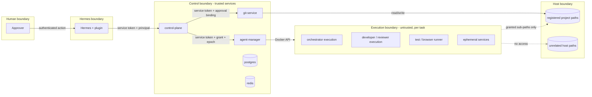

# Security Model

**Phase:** 1 (Architecture)  
**Status:** Approved by Gabriel Paredes on 2026-09-30 (PR #2)  
**Inputs:** [MASTER_SPEC.md](MASTER_SPEC.md) sections 11–13, 20–26, 39–41, 49, 53–55, 62, 82, 86, 89, 91; [DISCOVERY.md](DISCOVERY.md) D05, D06, D08, D11–D14  
**Related:** [ARCHITECTURE.md](ARCHITECTURE.md), [NETWORK_MODEL.md](NETWORK_MODEL.md), [schemas/capability.schema.json](schemas/capability.schema.json)

## 1. Security Goals

1. No code enters a protected branch without an explicit, action-bound human approval (§41).
2. A model-controlled process can affect only the workspace, network, and secrets it was granted for the current execution.
3. GitHub credentials, provider sessions, and project secrets never reach Git, PostgreSQL, logs, Task Manifests, artifacts, or normal backups.
4. One project's work cannot read or modify another project, or unrelated host locations.
5. Every sensitive decision is attributable and auditable without storing private model reasoning.

## 2. Assets

| Asset | Where it lives | Sensitivity |
| --- | --- | --- |
| Protected branches of registered projects | Host repositories, GitHub | Critical |
| User's working changes | Host checkout | Critical |
| GitHub CLI credentials | `gh-config` volume, `git-service` only | Critical |
| Provider sessions (Claude, Codex) for managed workers | `cred-<provider>-<identity>` volumes | High |
| Project secrets (test DB, staging, production) | Secrets backend, delivered per execution | High to critical |
| Hermes channel credentials | `hermes-data` volume | High |
| Internal service tokens and HMAC keys | Docker secrets files | High |
| Docker Engine control | `agent-manager` only | Critical (root-equivalent on the host or VM) |
| Execution state, approvals, audit trail | PostgreSQL | High (integrity) |
| Unrelated host files (`~/Documents`, `~/.ssh`, ...) | Host | Critical (must stay out of reach) |

## 3. Actors and Trust Levels

| Actor | Trust | Can influence | Notes |
| --- | --- | --- | --- |
| Operator / approver | Trusted when authenticated | Everything, through authenticated channels | Approvers are an explicit allowlist in platform configuration. |
| Channel sender who is not an approver | Untrusted | Task requests only, if Hermes allows the sender | Hermes' own sender allowlists apply first. |
| Hermes agent (LLM) | Untrusted for authorization | Read tools, task creation | May be prompt-injected by channel content. |
| Claude/Codex orchestrator execution | Untrusted for authorization | Action proposals only | Reads repository content that may contain injected instructions. |
| Developer, reviewer, and tester executions | Untrusted | Their workspace and output directory | Assumed capable of running any command available in their container. |
| Repository content (code, hooks, configs, docs) | Untrusted | Anything that executes it | Includes `.claude/`, `.codex/`, `.mcp.json`, Git hooks, build scripts. |
| External websites and packages | Untrusted | Workers with egress | Supply-chain and injection source. |
| control-plane, agent-manager, git-service | Trusted, least privilege | Their own domain | Separate identities and credentials. |
| Official Hermes code | Trusted as a dependency | Its own container | Pinned digest; no Docker socket or project mounts. |

The central assumption: **every model is treated as an adversary that follows its prompt most of the time.** Controls must hold even when a model deliberately tries to escape them.

## 4. Trust Boundaries

| Boundary crossing | Control |
| --- | --- |
| Human → Hermes | Hermes channel authentication and sender allowlists (upstream). |
| Hermes → control plane | Plugin service token; the principal is forwarded and checked against the approver allowlist for human-only actions. |
| control plane → Agent Manager / Git Service | Per-service tokens; requests carry `lease_epoch`, and grants or approval bindings are verified again by the callee. |
| Agent Manager → execution | Container configuration: mounts, networks, user, capabilities, limits (§8). |
| Execution → control plane | No network path. Output goes through Agent Manager collection and trusted ingestion (§10). |
| Execution → host | Only the bind mounts in the grant. |

## 5. Service Identities

| Identity | Authenticates to | Credential | Rotation |
| --- | --- | --- | --- |
| `hermes-plugin` | control-plane | Bearer token (Docker secret file) | Operator script; both old and new tokens accepted during rotation |
| `control-plane` → agent-manager | agent-manager | Bearer token | Same |
| `control-plane` → git-service | git-service | Bearer token | Same |
| `control-plane` → Hermes webhook | hermes | HMAC key for the webhook route | Same |
| `control-plane` → postgres / redis | postgres / redis | Password (Docker secret file) | Same |

Rules:
- Tokens live in Docker secrets (files under `/run/secrets`), never in `compose.yaml`, environment variables committed to Git, or logs.
- Each callee accepts only its expected caller identity. Agent Manager and Git Service accept requests only from the control plane.
- Tokens are compared in constant time. Requests are logged with caller identity, not token values.
- mTLS between internal services is a later hardening option. Services are already isolated on internal networks (NETWORK_MODEL §3).

## 6. Human Approval

### 6.1 Principals

A principal is `(channel, subject)`: for example `(telegram, 123456)`, `(dashboard, operator)`, or `(host-cli, <OS user>)`. `config/defaults.yaml` holds an approver allowlist, which may be overridden per machine. Only listed principals can decide approvals. The control plane never trusts a principal claimed by a model; it only accepts the principal forwarded by the plugin's human-only surfaces (AD-10) or the host CLI.

Open item OI-01: if slash command handlers cannot obtain a verifiable sender identity from the gateway, approvals are restricted to the Dashboard and host CLI. Hermes then only notifies.

### 6.2 Approval binding

An approval request is created by the control plane, never by a model directly. It binds:

| Field | Purpose |
| --- | --- |
| `approval_id` | Stable identifier. |
| `action` | Closed set: `MERGE`, `SCOPE_EXPANSION`, `BUDGET_INCREASE`, `BUDGET_UNLIMITED`, `HIGH_RISK_OPERATION`, `ENVIRONMENT_ACCESS`, `PROJECT_CONFIG_CHANGE`, `ASSUMPTION`, `UPDATE`, `PROJECT_READY`. |
| `task_id` / `project_id` | Scope. |
| `risk` | LOW, MEDIUM, HIGH, CRITICAL. |
| `subject` | Action-specific target, for example `{pr: 42, head_sha, base_sha, target_branch}` for merges. |
| `state_hash` | SHA-256 over the canonical JSON of the subject, the effective configuration hash, and the policy version. |
| `requested_at`, `expires_at` | Approvals expire (default 72 h for merges, configurable, never unbounded). |
| `decided_by`, `decided_at`, `decision` | Principal and outcome. |
| `evidence_refs` | Quality Gate evaluation, test results, reviews. |

### 6.3 Validation at use time

The component performing the action (Git Service for merges, the control plane for other actions) recomputes the state hash immediately before acting. It proceeds only if:

1. The decision is `APPROVED` by an allowlisted principal.
2. The approval has not expired and has not been used (single use).
3. The recomputed hash equals the approved hash. For merges this includes the PR head SHA, the target base SHA, and the Quality Gate evaluation ID.
4. The task is still in the state the approval was requested from.

A mismatch invalidates the approval, records an event, and returns the task to the appropriate state with a new request if still needed. Examples of mismatch: new commits, changed base, changed configuration, or a policy version change.

### 6.4 Hard approval boundaries

No autonomy profile, project configuration, or task override can remove these (§26):

- Merging into any protected branch (default `main`, `master`, plus the project list).
- Production deployment and any production write.
- Destructive database operations outside ephemeral test environments.
- Access to production secrets.
- Security, permission, network-policy, or infrastructure changes to the platform or a project's protected configuration.
- Destructive Git operations: force push, branch deletion, history rewrite of shared branches.
- Major architecture migration (as classified by the Policy Engine or declared by the orchestrator).
- `UNLIMITED` budgets and significant scope expansion.

## 7. Credentials and Secrets

### 7.1 Provider sessions (Credential Broker)

| Aspect | Design |
| --- | --- |
| Storage | One Docker named volume per provider identity: `cred-claude-<identity>`, `cred-codex-<identity>`. Not a host bind mount of personal `~/.claude` or `~/.codex`. |
| Bootstrap | Host operator command (for example `make auth-claude IDENTITY=default`) runs an interactive container from the pinned worker image with only that volume mounted. The user completes the documented login flow (Claude subscription login, Codex ChatGPT or device-code login). No model is involved. |
| Use | Agent Manager mounts the volume only into containers of the matching provider. Other providers' volumes, `gh-config`, and Hermes volumes are never mounted into workers. |
| Records | PostgreSQL stores only `credential_ref = {provider, identity, status, last_verified_at}`. Never tokens or file contents. |
| Expiry | Adapter failure classification `AUTH` sets the provider identity to `AUTH_REQUIRED`, pauses affected work at a checkpoint, and notifies. After re-login, work resumes from the checkpoint. |
| Backups | Excluded by volume name (§12). |
| macOS Keychain | Not used for container sessions: Linux containers cannot read the host Keychain, and a host helper would add a privileged bridge. Container-native volumes reside inside the Docker Desktop VM disk. Revisit only if Phase 4 shows the volume approach cannot satisfy provider requirements. |
| Codex vs. API keys | Subscription login is the requested default. If a flow requires switching to API-key billing, the platform stops with `AUTH_REQUIRED` and a documented reason rather than silently switching (D13). |

**Residual risk R-01:** the provider CLI needs its session inside the container where the model also runs shell commands, so a malicious or injected model could read and exfiltrate its own provider session. Mitigations: a dedicated identity used only by the platform (revocable independently of the user's personal login), no other credentials in the container, network restrictions when a project requires them, egress audit, and short container lifetimes. Phase 4 must verify whether the CLIs offer a supported way to keep credentials outside the command sandbox (OI-02, OI-03). If they do, it becomes the default.

### 7.2 GitHub credentials

- `gh auth login` runs once via a host operator command in a git-service bootstrap container, storing configuration in the `gh-config` volume (§40).
- Only `git-service` mounts `gh-config`. Workers commit locally; they cannot push because no remote credential exists in their environment and their clone has no credential helper configured.
- Git Service uses a Git credential helper backed by `gh` for HTTPS remotes. SSH keys from the host are not mounted.
- Future GitHub App support replaces the `gh` token with installation tokens behind the same Git Service interface.

### 7.3 Project secrets (Secrets Broker)

- `.hermes/project.yaml` references secrets by name and scope. Values never appear in project configuration.
- v1 backend: files in a dedicated `secrets` directory outside the projects root (operator-managed, mode 0600), keyed by `project/environment/name`, mounted read-only only into `agent-manager`. The control plane decides which references a grant contains but never reads values. Later backends (OS keychain helper, external vault) implement the same interface.
- A grant lists secret references. Agent Manager materializes only those secrets as files in a per-execution tmpfs mount; environment variables are used only when a tool requires them.
- Agent Manager, which already holds the delivered values, replaces them in everything it collects from the execution (stdout events and output files) before forwarding. The control plane then applies generic token and credential patterns to all ingested output, artifacts, events, and error messages.
- Production secrets require `ENVIRONMENT_ACCESS` approval every time; they are never granted to test runners or reviewers.

### 7.4 Environment access

| Environment | Default | Escalation |
| --- | --- | --- |
| LOCAL / TEST | Allowed within grant | — |
| STAGING | `STAGING_READ` only | `STAGING_WRITE` needs approval |
| PRODUCTION | Denied | `PROD_READ` or `PROD_WRITE` needs separate approvals; time-limited grant; every use audited. Destructive production operations remain blocked by hard policy even with approval unless a dedicated `HIGH_RISK_OPERATION` approval names the exact operation. |

## 8. Execution Isolation

### 8.1 Container baseline (all dynamic containers)

Agent Manager enforces these invariants regardless of what the Policy Engine sent:

| Invariant | Setting |
| --- | --- |
| Non-root | Image user with fixed UID/GID; `--user` set explicitly. |
| No privilege escalation | `no-new-privileges`; `cap_drop: ALL`; no `cap_add` except allowlisted per runner type (none for agent workers). |
| No Docker access | Reject any mount of `docker.sock`, `/var/run`, `/run/docker*`, containerd, or podman sockets. |
| No host namespaces | Reject `network_mode: host`, `pid: host`, `ipc: host`, `privileged`, device mounts. |
| Filesystem | Read-only root filesystem; writable paths limited to the workspace, the output directory, `/tmp` (tmpfs), and cache mounts. |
| Mounts | Only paths inside the registered project's directory that are named in the grant, the per-execution output directory, the matching provider credential volume, and allowed cache volumes. All paths are resolved (symlinks followed) and re-checked against the project root. |
| Images | Only digests present in the active machine profile. |
| Resources | CPU, memory, PIDs, and ephemeral storage limits from the resource profile; wall-clock timeout from the grant. |
| Networks | Only the networks in the execution's network plan (NETWORK_MODEL §4). |
| Labels | `ho.task`, `ho.execution`, `ho.project`, `ho.role`, `ho.epoch` on every object for reconciliation. |

### 8.2 Role grants

Default grants per role. Capability values are defined in [schemas/capability.schema.json](schemas/capability.schema.json).

| Role | Workspace | Project read | Git | Network | Secrets | Docker | Production |
| --- | --- | --- | --- | --- | --- | --- | --- |
| ORCHESTRATOR | NONE (context bundle READ) | READ, registered projects of the task | READ | Project development mode (at least PROVIDER_ONLY) | none | NONE | NONE |
| DEVELOPER | WRITE (own workspace) | — | LOCAL_COMMIT | Project development mode (at least PROVIDER_ONLY), plus test services when needed | test-scoped only, if granted | NONE | NONE |
| REVIEWER | READ | — | READ | PROVIDER_ONLY (ALLOWLIST if the project enables research) | none | NONE | NONE |
| TESTER | WRITE to a disposable copy of the integration workspace | — | NONE | egress NONE, test services only | test-scoped only | NONE | NONE |
| BROWSER | NONE (artifacts READ) | — | NONE | egress NONE, test services only | test credentials only | NONE | NONE |

Rules:
- `docker` is always `NONE` for dynamic containers; the schema makes any other value invalid.
- Claude may request broader values in `REQUEST_EXECUTION`. The Policy Engine grants the intersection of the request, the role maximum, the project policy, and hard policy. It never grants the union.
- Grants expire with the execution or at `expires_at`, whichever comes first. Revocation stops the execution.
- Reviewers receive WRITE only when explicitly assigned fixes, which makes them DEVELOPER executions on that workspace.
- When Claude acts as a developer, it gets WRITE only to the assigned workspace (§13), and a Codex review becomes mandatory.

## 9. Untrusted Repository Handling

Repository content is attacker-controllable. Rules:

1. **No model runs outside a sandboxed container.** Hermes has no project mounts.
2. **The main repository's `.git` is never writable from a container.** Isolated clones (AD-06) keep hooks and configuration of the main repository out of reach.
3. **Git Service treats task clones as hostile.** It only fetches from them with hooks disabled (`core.hooksPath` pointed to an empty directory), `core.fsmonitor` off, `protocol.file.allow` restricted to the clone path, and no porcelain commands (`status`, `checkout`, `diff` with external tools) inside the clone. `safe.directory` is set per path, never `*`.
4. **Git Service never executes repository scripts.** Builds and tests always run in runners.
5. **Provider CLI project configuration** (`.claude/settings.json` hooks, `.mcp.json`, Codex project configuration, `AGENTS.md`, `CLAUDE.md`) executes only inside the worker container. Phase 4 must configure the pinned CLIs with managed or command-line settings that disable or restrict repository-defined hooks and MCP servers where officially supported (OI-02). Instruction files are context, not policy.
6. **Onboarding is read-only.** The scan runs in a Git Service read-only mode or in an ORCHESTRATOR execution with READ only; proposals are written to artifacts and applied only after approval (§15).
7. **Generated Compose overrides** for project services are rendered by the control plane from the project's Compose files, with hard-policy validation: no privileged services, no host mounts outside the workspace, no host networking, no Docker socket, and only the task's private networks.

## 10. Output Ingestion

All data returning from executions passes through the control plane's ingestion pipeline:

1. Size limits per file and per execution; excess is truncated and flagged.
2. Schema validation for `result.json`, review findings, test results, and action proposals.
3. Event allowlist: adapters keep only known operational event types. Provider reasoning items and raw transcripts are dropped (D11, §86).
4. Redaction: literal secret values were already replaced by Agent Manager during collection (§7.3); the control plane applies generic token and credential patterns.
5. Content hash recorded; artifacts are stored under the task's project partition.
6. Paths in results are resolved relative to the workspace; references outside it are rejected.

## 11. Command and Action Policy

Enforcement happens in layers (AD-14):

| Layer | What it enforces | Can a model bypass it? |
| --- | --- | --- |
| Capability absence | No Docker, GitHub, production, or unrelated-project access exists in the container. | No: the capability is not present. |
| Control-plane actions | Push, PR, merge, environment access, secret grants, network expansion, worker creation. Classified SAFE, CONTROLLED, or HIGH RISK and decided by the Policy Engine. | No: only trusted services execute them. |
| Provider CLI permission settings | Tool and command allowlists and approval modes of Claude Code and Codex, configured per role. | Partially: they are best-effort inside the sandbox. |
| Advisory classification | The in-container runner and adapters classify observed commands and record `COMMAND_STARTED` / `COMMAND_FINISHED` events. HIGH RISK patterns raise an alert and can stop the execution. | Yes: it detects, it does not prevent. |

Classification (§24):

| Class | Examples | Default decision |
| --- | --- | --- |
| SAFE | Read, search, build, test, lint, typecheck, `git status`, `git commit` in own workspace | Automatic |
| CONTROLLED | Package installs, downloads, new network destinations, environment changes, creating ephemeral services, pushing a non-protected branch | Evaluated against project policy and autonomy profile |
| HIGH RISK | Destructive DB operations, mass deletion outside the workspace, force push, repository or branch deletion, production deployment or infrastructure changes, secret access, permission/security changes | Approval flow; some remain hard-denied (§6.4) |

## 12. Audit, Logging, and Backups

- Every approval decision, grant issuance and revocation, policy decision, Agent Manager and Git Service call, failover, and merge writes an append-only audit event with actor, principal, target, decision, and reason summary (§49). Update and delete privileges on the audit table are revoked from the application role.
- Logs are JSON and pass through the same redaction. Model reasoning and raw provider transcripts are never logged or stored.
- Backups (Phase 11) are allowlist-based: PostgreSQL dump, platform configuration, and selected non-secret Hermes files. The backup script refuses to include volumes named `cred-*` or `gh-config`, the secrets directory, or `redis-data`.

## 13. Threats and Controls

| ID | Threat | Controls | Test (Phase 11 unless noted) |
| --- | --- | --- | --- |
| T01 | Worker reads another project or unrelated host paths | Mount allowlist, path resolution, per-project networks | Worker attempts `~/.ssh`, other project path |
| T02 | Worker reaches the Docker daemon | No socket mounts, no host namespaces, invariant check in Agent Manager | Worker attempts Docker socket and TCP API |
| T03 | Worker pushes to or deletes protected branches | No remote credentials in workers; Git Service rules | Worker attempts push; Git Service force-push request is rejected |
| T04 | Prompt-injected Hermes agent approves a merge | Approvals are not LLM tools; principal allowlist | Tool-call attempt; forged principal header |
| T05 | Stale approval used after new commits | State hash and head SHA binding, single use | Commit after approval, then merge attempt |
| T06 | Orchestrator self-grants capabilities or forges completion | Closed action vocabulary; control-plane-owned transitions | Proposal with forbidden action or field |
| T07 | Two orchestrators lead one task | PostgreSQL lease with epoch fencing | Concurrent acquire; stale epoch request |
| T08 | Secrets leak into logs, artifacts, or manifests | Redaction set, ingestion pipeline, schema without secret fields | Canary secret search across outputs |
| T09 | Malicious repository hook runs on the host | Isolated clones; hardened fetch; no host-side execution | Clone containing hooks and fsmonitor config |
| T10 | Test runner reaches the Internet or production | Internal test networks; production blocked | Egress attempt from test runner |
| T11 | Provider session exfiltration (R-01) | Dedicated identity, egress policy, short lifetimes | Documented residual risk; audit visibility |
| T12 | Project configuration weakens hard policy | Schema limits plus Policy Engine clamp | Config with `docker: WRITE`, production defaults |
| T13 | Dashboard plugin route reachable without auth | Upstream middleware; runtime verification | Unauthorized requests (Phase 9) |
| T14 | Duplicate user request silently dropped | Relationship engine records every request | Duplicate submission |
| T15 | Agent Manager compromise through malformed requests | Service token, strict schema, invariant checks, minimal code | Fuzzed specs with forbidden mounts or flags |

## 14. Traceability to Absolute Rules (§91)

| Rule | Where enforced |
| --- | --- |
| 1–3 No fork, reuse Hermes, no invented APIs | AD-01; ARCHITECTURE §7 verification column |
| 4 No Docker socket in workers | §8.1 invariant; T02 |
| 5 No unrestricted host access | §8.1 mounts; T01 |
| 6 No shared unrelated workspaces | §8.1; NETWORK_MODEL per-project networks |
| 7 No GitHub credentials in workers | §7.2; T03 |
| 8 No provider credentials in Git/PostgreSQL/logs | §7.1 records; §10 redaction |
| 9 No secrets in manifests | §7.3; manifest schema has no secret-value fields |
| 10 No stored chain-of-thought | §10 step 3; §12 |
| 11 No automatic merge to main/master | §6.4; Git Service merge requires approval token |
| 12 No silent overwrite of human changes | Isolated clones; Git Service divergence classification (§37) |
| 13 Project config cannot bypass hard policy | ARCHITECTURE §9.1 clamp; T12 |
| 14 No default production access | §7.4 |
| 15 No self-granted capabilities | §8.2; T06 |
| 16 Workers cannot create containers | T02; Agent Manager is the only Docker client |
| 17 Redis is not sole state | DATA_MODEL §8 |
| 18 Hermes not required for authorized work | ARCHITECTURE §14 |
| 19 No silently discarded duplicates | T14; DATA_MODEL `task_relationships` |
| 20 No dual leaders | T07; DATA_MODEL `task_leases` |
