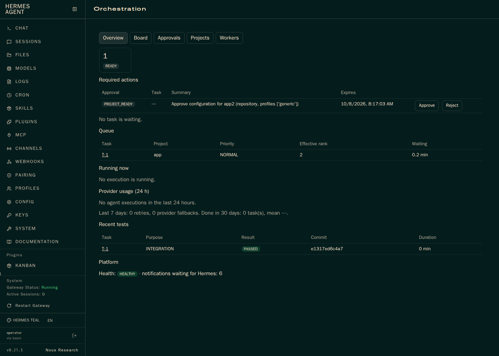

# Phase 10 Validation: Dashboard and UX

Branch `codex/phase-10-dashboard`. Design: [docs/design/phase-10.md](../design/phase-10.md).

## What was built

- **The Orchestration tab** in Hermes's own Dashboard (plugin from Phase 9, listed in the Plugins section of Hermes's sidebar with Kanban and Achievements — a scrollable area that shows its first entry in the screenshot), with client-side views:
  - **Overview**: required actions (pending approvals with Approve/Reject; tasks waiting for approval, login, budget, fixes, or a human), task counts by state, the queue with effective priority and waiting time, running executions with duration, provider usage over 24 hours (executions, successes, failures, tokens, mean duration), retries and provider fallbacks over 7 days, done tasks and mean duration over 30 days, recent test results, platform health, and notifications waiting for Hermes.
  - **Board**: read-only Kanban columns by task state.
  - **Task**: controls (pause, resume, cancel, retry), the plan DAG by dependency level with subtask states, approvals, budget (used, reserved, limits, including runtime), Quality Gate requirements and residual risk, reviews with findings, verifications with test runs, executions with provider, failure, tokens, and duration, Git state, manifests (view stored, generate on demand), the audit timeline, and checkpoints.
  - **Projects**, **Workers** (capacity plus CPU and memory per running worker), **Approvals**.
- **Read models** (`control_plane/dashboard.py`): computed from PostgreSQL on request, no new tables; `GET /v1/dashboard/summary`, `GET /v1/dashboard/tasks/{key}`, `GET /v1/tasks/{key}/manifests[/{id}]`; `GET /v1/workers` now includes running executions with CPU and memory from Agent Manager's new `GET /v1/stats`.
- **Metrics**: `GET /metrics` (operator token) in the Prometheus text format: tasks, queue length, executions, provider tokens, approvals, notifications, component health. No Prometheus or OpenTelemetry is required in v1; this is the integration point.

## Reuse decisions

- Hermes's administration, logs, sessions, skills, cron, channels, models, and keys are reused untouched; the tab adds only orchestration views.
- Hermes's Kanban board is not used for platform tasks: it would need a second writer of task state (AD-02, D01). The tab renders its own read-only board from the Task API; OI-08 (a read-only projection into Hermes's board) stays open for after v1.
- The tab uses Hermes's Dashboard login and plugin SDK (`fetchJSON` handles authentication).

## Evidence

| Check | Result |
| --- | --- |
| `make lint`, `make validate-schemas`, `node --check` on the tab | pass |
| `make test-unit` | 229 passed |
| `make test-integration` | 134 passed (5 in `test_dashboard.py`; the orchestrated happy path now also checks the task view and its manifest) |
| `scripts/smoke-phase10.sh` | all checks pass |
| `scripts/smoke-phase2.sh` … `smoke-phase9.sh` | all pass |

The Phase 10 smoke builds real data on a throwaway stack (two projects, a task with an execution, a workspace change verified by the Test Runner, a pending approval), checks every tab API route behind Hermes's login (anonymous requests refused), checks `/metrics` (Prometheus text for the operator, 403 for the plugin token), and renders the tab in headless Chromium (the Browser Runner image): login through Hermes, overview, the tab in Hermes's sidebar, board, the task's ten sections, projects, workers, and an approval decided from the page and recorded as `dashboard:operator`. The screenshot above comes from that run.

## Codex review (`/codex:review --base main`)

Two findings, both fixed: the task view's budget showed 0 runtime minutes (runtime is computed from the task's start, now merged into the view), and execution counts by state were exposed as a Prometheus counter although they decrease (now the gauge `ho_executions`).

## Known limitations

- The views poll every 10 seconds; there is no event stream yet.
- The DAG is drawn as columns by dependency level, not as a graph with edges.
- CPU and memory come from one Docker stats sample per running worker when the Workers view loads.

## Operator review

- [x] Merged under the operator's standing authorization (2026-10-01).
